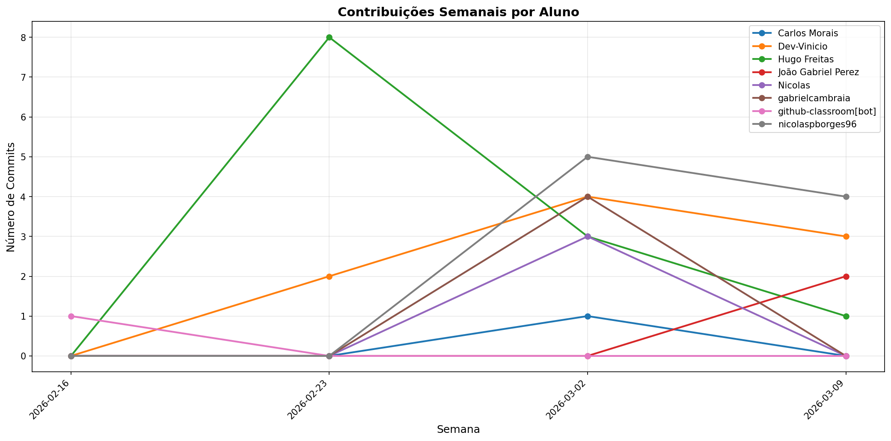

# 📊 Relatório de Contribuições do Projeto

**Última atualização:** 16/03/2026 23:47

---

## 📈 Resumo Geral de Contribuições

| Aluno                 |   Commits |   Linhas+ |   Linhas- |   Arquivos |   Docs Commits |   Docs Arquivos |
|-----------------------|-----------|-----------|-----------|------------|----------------|-----------------|
| Carlos Morais         |         1 |         1 |        10 |          1 |              1 |               1 |
| Dev-Vinicio           |         9 |       476 |       275 |          3 |              9 |               3 |
| Hugo Freitas          |        12 |        73 |        26 |          7 |             11 |               5 |
| João Gabriel Perez    |         2 |       666 |         5 |         12 |              1 |               1 |
| Nicolas               |         3 |       412 |       212 |         20 |              1 |               1 |
| gabrielcambraia       |         4 |        15 |        12 |          2 |              4 |               2 |
| github-classroom[bot] |         1 |      2152 |         0 |         45 |              1 |              13 |
| nicolaspborges96      |         9 |      1687 |       271 |         52 |              5 |               2 |

## 📅 Contribuições Semanais (Todo o Semestre)

**2026-03-09**: Dev-Vinicio: 3, Hugo Freitas: 1, João Gabriel Perez: 2, nicolaspborges96: 4

**2026-03-02**: Carlos Morais: 1, Dev-Vinicio: 4, Hugo Freitas: 3, Nicolas: 3, gabrielcambraia: 4, nicolaspborges96: 5

**2026-02-23**: Dev-Vinicio: 2, Hugo Freitas: 8

**2026-02-16**: github-classroom[bot]: 1

## 📊 Visualização Gráfica

## ℹ️ Observações

- **Commits**: Número total de commits realizados

- **Linhas+**: Linhas de código adicionadas

- **Linhas-**: Linhas de código removidas

- **Arquivos**: Número de arquivos únicos modificados

- **Docs Commits**: Commits em arquivos de documentação

- **Docs Arquivos**: Arquivos de documentação modificados

---

*Relatório gerado automaticamente via GitHub Actions*
