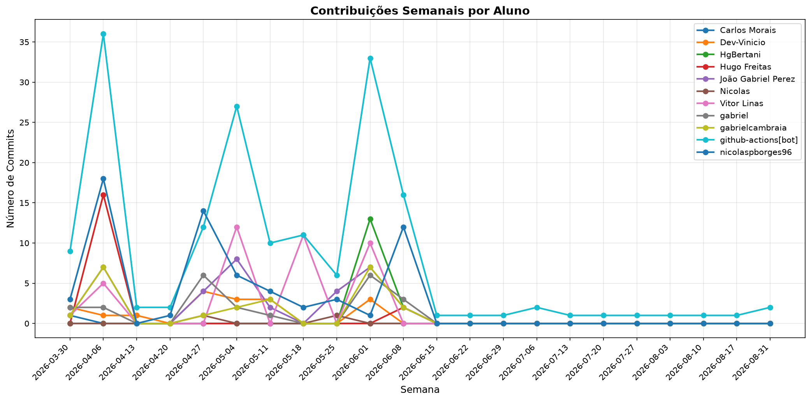

# 📊 Relatório de Contribuições do Projeto

**Última atualização:** 07/06/2026 18:55

---

## 📈 Resumo Geral de Contribuições

| Aluno                 |   Commits |   Linhas+ |   Linhas- |   Arquivos |   Docs Commits |   Docs Arquivos |
|-----------------------|-----------|-----------|-----------|------------|----------------|-----------------|
| Carlos Morais         |         2 |         7 |        15 |          2 |              2 |               2 |
| Dev-Vinicio           |        26 |     68929 |     52625 |        318 |             19 |              15 |
| Hugo Freitas          |        28 |       481 |        90 |         14 |             16 |               6 |
| João Gabriel Perez    |        34 |      9904 |      2600 |        112 |              7 |               2 |
| Nicolas               |         6 |      7686 |      1021 |        106 |              2 |               2 |
| Vitor Linas           |        41 |      1535 |       367 |         21 |             14 |               3 |
| gabriel               |        18 |      7120 |      1041 |         90 |              0 |               0 |
| gabrielcambraia       |        24 |       958 |        56 |          4 |             12 |               3 |
| github-actions[bot]   |       146 |      1203 |      1178 |          3 |            141 |               1 |
| github-classroom[bot] |         1 |      2152 |         0 |         45 |              1 |              13 |
| nicolaspborges96      |        66 |     46492 |     18312 |        319 |             24 |               6 |

## 📅 Contribuições Semanais (Todo o Semestre)

**2026-05-31**: Dev-Vinicio: 2, João Gabriel Perez: 6, Vitor Linas: 4, gabriel: 5, gabrielcambraia: 6, github-actions[bot]: 18, nicolaspborges96: 1

**2026-05-24**: João Gabriel Perez: 4, Nicolas: 1, github-actions[bot]: 6, nicolaspborges96: 3

**2026-05-17**: Vitor Linas: 11, github-actions[bot]: 11, nicolaspborges96: 2

**2026-05-10**: Dev-Vinicio: 4, João Gabriel Perez: 6, Vitor Linas: 1, gabriel: 1, gabrielcambraia: 4, github-actions[bot]: 16, nicolaspborges96: 4

**2026-05-03**: Dev-Vinicio: 2, João Gabriel Perez: 4, Vitor Linas: 11, gabriel: 2, gabrielcambraia: 1, github-actions[bot]: 21, nicolaspborges96: 6

**2026-04-26**: Dev-Vinicio: 4, João Gabriel Perez: 4, Nicolas: 1, gabriel: 6, gabrielcambraia: 1, github-actions[bot]: 12, nicolaspborges96: 14

**2026-04-19**: github-actions[bot]: 2, nicolaspborges96: 1

**2026-04-12**: Dev-Vinicio: 1, Hugo Freitas: 11, Vitor Linas: 2, github-actions[bot]: 15

**2026-04-05**: Carlos Morais: 1, Dev-Vinicio: 1, Hugo Freitas: 5, João Gabriel Perez: 7, Vitor Linas: 3, gabriel: 2, gabrielcambraia: 7, github-actions[bot]: 25, nicolaspborges96: 18

**2026-03-29**: Dev-Vinicio: 2, João Gabriel Perez: 1, Nicolas: 1, Vitor Linas: 1, gabriel: 2, gabrielcambraia: 1, github-actions[bot]: 8, nicolaspborges96: 3

**2026-03-22**: Vitor Linas: 8, github-actions[bot]: 9, nicolaspborges96: 3

**2026-03-15**: Dev-Vinicio: 1, Hugo Freitas: 1, github-actions[bot]: 3, nicolaspborges96: 3

**2026-03-08**: Carlos Morais: 1, Dev-Vinicio: 4, Hugo Freitas: 3, João Gabriel Perez: 2, Nicolas: 2, nicolaspborges96: 5

**2026-03-01**: Dev-Vinicio: 5, Nicolas: 1, gabrielcambraia: 4, nicolaspborges96: 3

**2026-02-22**: Hugo Freitas: 8

**2026-02-15**: github-classroom[bot]: 1

## 📊 Visualização Gráfica

## ℹ️ Observações

- **Commits**: Número total de commits realizados

- **Linhas+**: Linhas de código adicionadas

- **Linhas-**: Linhas de código removidas

- **Arquivos**: Número de arquivos únicos modificados

- **Docs Commits**: Commits em arquivos de documentação

- **Docs Arquivos**: Arquivos de documentação modificados

---

*Relatório gerado automaticamente via GitHub Actions*
