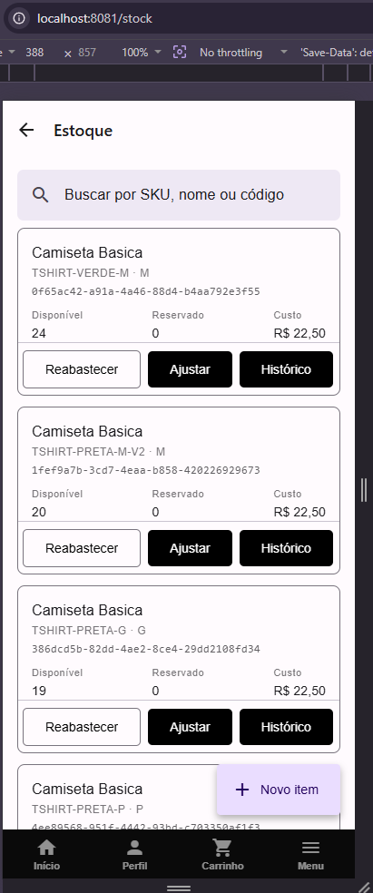
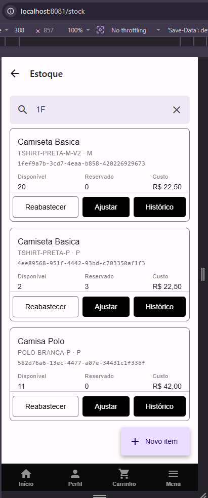
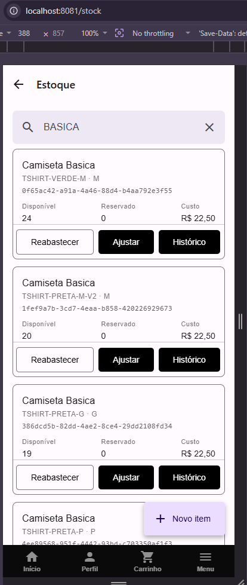
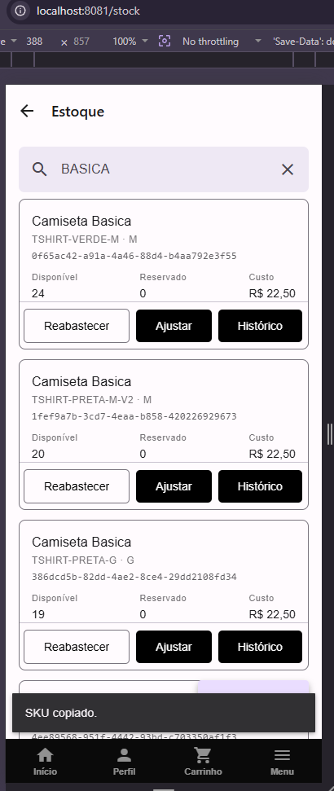
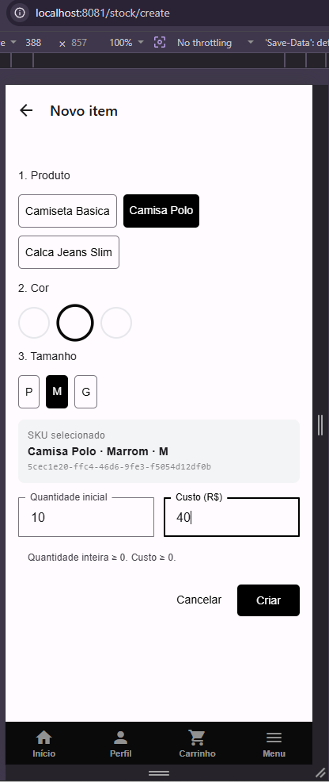
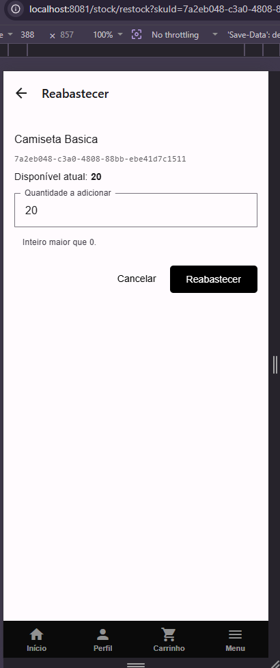
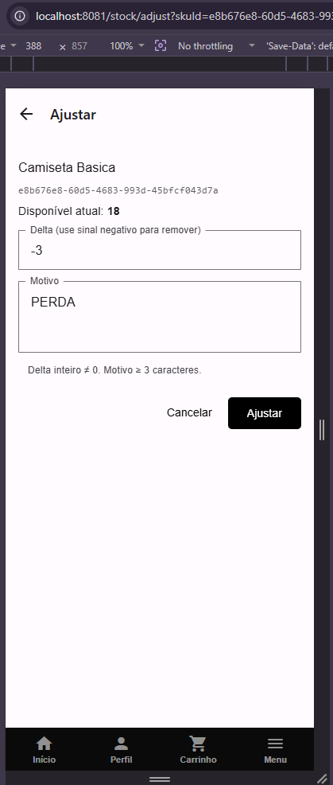
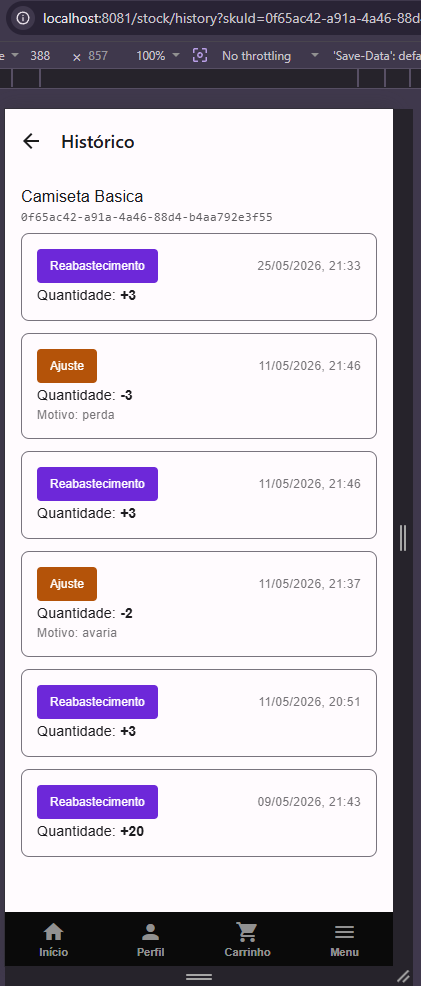

# Front-end Móvel

O front-end móvel do e-commerce escalável é desenvolvido com **React Native via Expo**, entregando uma experiência nativa em iOS e Android a partir de uma única base de código. A aplicação cobre os principais domínios da plataforma — catálogo, notificações, pagamentos, estoque e usuários — organizados em módulos independentes que consomem cada microserviço de backend via API REST.

---

# Front-end Móvel — Módulo de Catálogo

O módulo de catálogo é o coração da aplicação mobile: permite que clientes naveguem por produtos organizados em categorias, filtrem por nome, visualizem variantes de cor e tamanho com verificação de estoque em tempo real e adicionem itens ao carrinho. Administradores têm, na mesma interface, acesso a criação, edição e exclusão de produtos, variantes e SKUs.

---

## Projeto da Interface

O módulo é composto por quatro telas principais conectadas por navegação em pilha (Expo Router) e um formulário modal exclusivo para administradores:

- **`CatalogScreen`** — tela inicial com busca, filtros por categoria e grade de produtos.
- **`CategoriesScreen`** — listagem e gerenciamento de categorias.
- **`ProductsByCategoryScreen`** — produtos filtrados por categoria selecionada.
- **`ProductDetailScreen`** — detalhe completo com seleção de variante, SKU, quantidade e adição ao carrinho.
- **`ProductFormScreen`** — formulário modal (admin) para criar e editar produtos com variantes e SKUs.

### Wireframes

#### Tela Principal — Catálogo (`/`)

```
┌─────────────────────────────┐
│  Bom dia, Gabriel           │
│  12 produtos encontrados    │
│                             │
│  [🔍 Buscar produto...]     │
│                             │
│  [Todos][Camisetas][Calças] │
│                             │
│  ┌──────┐  ┌──────┐        │
│  │ IMG  │  │ IMG  │        │
│  │[Cat] │  │[Cat] │        │
│  │Nome  │  │Nome  │        │
│  │R$ XX │  │R$ XX │        │
│  └──────┘  └──────┘        │
│  ┌──────┐  ┌──────┐        │
│  │  ... │  │  ... │        │
│  └──────┘  └──────┘        │
│                          [+]│
└─────────────────────────────┘
```

Elementos da tela:
- **Saudação:** texto personalizado por horário (Bom dia / Boa tarde / Boa noite) com nome do usuário e badge de contagem de produtos.
- **Barra de busca:** filtragem local em tempo real por nome do produto.
- **Chips de categoria:** scroll horizontal; ao selecionar uma categoria, dispara nova requisição à API.
- **Grade 2 colunas:** `ProductCard` clicável (navega ao detalhe) e com long-press para ações admin.
- **FAB `+`:** visível apenas para administradores, abre o formulário de criação.

#### Tela de Detalhe — `/catalog/product/[id]`

```
┌─────────────────────────────┐
│ ←  Nome do Produto          │
│                             │
│  ┌─────────────────────┐   │
│  │       IMAGEM         │   │
│  └─────────────────────┘   │
│  [Categoria]                │
│  Nome do Produto            │
│  Descrição do produto...    │
│                             │
│  Cor:                       │
│  ●  ●  ○  (swatches)       │
│                             │
│  Tamanho:                   │
│  [P R$50] [M R$55] [G R$60]│
│                             │
│  Quantidade:  [−] 1 [+]    │
│                             │
│  [ Adicionar ao Carrinho  ] │
└─────────────────────────────┘
```

Elementos da tela:
- **Imagem:** carregamento com `expo-image`; fallback para ícone `image-off` em caso de erro.
- **Badge de categoria** e **preço dinâmico**: exibe menor preço sem seleção; atualiza ao selecionar SKU.
- **Swatches de cor:** variantes esgotadas com opacidade reduzida e riscado.
- **Chips de tamanho:** SKUs sem estoque desabilitados.
- **Seletor de quantidade:** limitado ao estoque disponível menos itens já no carrinho.
- **Botões admin:** editar e excluir, visíveis apenas para `role === 'admin'`.

#### Formulário de Produto — `/catalog/admin/product-form` (modal)

```
┌─────────────────────────────┐
│  Novo Produto            ✕  │
│                             │
│  Nome *                     │
│  [ Nome do produto       ]  │
│  Descrição                  │
│  [ Descrição...          ]  │
│  URL da imagem              │
│  [ https://...           ]  │
│  Categoria                  │
│  [ Selecionar ▾          ]  │
│                             │
│  Variantes                  │
│  ┌───────────────────────┐  │
│  │ ● Azul         1 SKU  │  │
│  │   [P  SKU-001  R$50 ] │  │
│  │   [+ Adicionar SKU  ] │  │
│  └───────────────────────┘  │
│  [+ Adicionar variante    ]  │
│                             │
│  [  Cancelar  ] [  Salvar ] │
└─────────────────────────────┘
```

---

### Design Visual

| Item | Definição |
|---|---|
| Framework de UI | React Native Paper (Material Design 3) |
| Fundo de tela | Branco / `#F8F9FA` |
| Cards de produto | `Card` do Paper com sombra leve |
| Badge de categoria | Fundo colorido arredondado, `labelSmall` |
| Preço | Negrito, `20sp`, cor primária do tema |
| Swatch de cor selecionado | Anel de borda dupla na cor escolhida |
| Swatch esgotado | Opacidade `0.4`, linha riscada |
| Chip de SKU desabilitado | Opacidade reduzida, não interativo |
| Botão "Adicionar ao Carrinho" | Botão primário ocupando largura total |
| FAB de criação | Ícone `+`, posição fixa inferior direita |
| Skeleton loading | Retângulos animados no lugar dos cards |
| Banner de erro | Fundo vermelho com mensagem e botão retry |

Estilos aplicados via `StyleSheet` do React Native combinados com componentes do `react-native-paper`.

---

## Fluxo de Dados

```
Backend (CatalogService :7000)
        │
        │  GET  /api/catalog/products          (lista com filtros)
        │  GET  /api/catalog/products/{id}     (detalhe + variantes + SKUs)
        │  POST /api/catalog/products          (admin)
        │  PUT  /api/catalog/products/{id}     (admin)
        │  DELETE /api/catalog/products/{id}   (admin)
        │  GET  /api/catalog/categories
        │  POST /api/catalog/categories        (admin)
        │  PUT  /api/catalog/categories/{id}   (admin)
        │  DELETE /api/catalog/categories/{id} (admin)
        │  POST /api/catalog/products/{id}/variants  (admin)
        │  POST /api/catalog/variants/{id}/skus      (admin)
        │  PATCH /api/catalog/skus/{id}              (admin)
        │
Backend (StockService)
        │  GET  /stock/{skuId}   → quantityAvailable (por SKU, paralelo)
        │
        ▼
App Mobile (React Native / Expo)
        │
        ├─► CatalogScreen         → lista de produtos + busca + filtro categoria
        ├─► CategoriesScreen      → gestão de categorias
        ├─► ProductsByCategoryScreen → produtos filtrados
        ├─► ProductDetailScreen   → detalhe + variante/SKU/qtd + carrinho
        │        └─► CartContext.addItem()  → estado global do carrinho
        └─► ProductFormScreen     → criação/edição (admin)
```

**Como funciona:**
1. `CatalogScreen` carrega categorias e produtos em paralelo no `useEffect`.
2. Ao selecionar uma categoria, dispara `getProducts({ categoryId })` — nova requisição à API.
3. A busca por nome filtra localmente o array já carregado.
4. `ProductDetailScreen` busca o produto pelo id e, em paralelo, consulta o estoque de cada SKU via `stockService.getBySku()`.
5. `handleAddToCart()` grava no `CartContext` (estado em memória) com `skuId`, `productId`, `unitPrice`, `size`, `color` e `quantity`.
6. O formulário admin encadeia criação de produto → variantes → SKUs em sequência.

---

## Tecnologias Utilizadas

| Tecnologia | Versão | Uso |
|---|---|---|
| React Native | 0.81.5 | Framework base para UI nativa |
| Expo | ~54 | Toolchain, build e APIs nativas |
| expo-router | 6.0.23 | Navegação file-based com rotas tipadas |
| react-native-paper | 5.15.2 | Componentes Material Design 3 |
| expo-image | — | Carregamento otimizado de imagens |
| @expo/vector-icons | — | Ícones MaterialCommunityIcons |
| TypeScript | ~5.8 | Tipagem estática em todo o projeto |
| React Context API | — | Estado global (CartContext, AuthContext) |
| Fetch API nativa | — | Chamadas HTTP via httpClient customizado |

---

## Considerações de Segurança

| Tópico | Estado atual |
|---|---|
| Autenticação | Requisições de escrita enviam `Authorization: Bearer <token>` via `httpClient.ts` |
| Autorização | Controle de visibilidade de ações admin por `user?.role === 'admin'` no front-end; validação real no backend |
| Validação de formulários | Nome obrigatório, preço ≥ 0, variante sem cor bloqueia envio |
| Proteção de URLs de imagem | Caminhos relativos são prefixados com `IMAGE_BASE_URL` configurado; sem carregamento de conteúdo externo arbitrário |
| Limite de quantidade | Máximo adicionável ao carrinho restringido ao `quantityAvailable` retornado pelo StockService |
| Erros de API | Mensagens de erro exibidas sem expor detalhes internos; respostas HTML inesperadas detectadas e traduzidas |
| Transporte | HTTP em desenvolvimento; HTTPS obrigatório em produção |

---

## Implantação

**Pré-requisitos:** Node.js 20+, Expo CLI e Docker Desktop instalados.

1. Subir o banco e o backend de catálogo:
   ```powershell
   cd src/services/catalog
   dotnet run
   ```
2. Configurar as variáveis de ambiente em `src/mobile/.env`:
   ```
   EXPO_PUBLIC_API_URL=http://192.168.0.4:7000/api
   EXPO_PUBLIC_IMAGE_BASE_URL=http://192.168.0.4:7000/images/products
   ```
3. Subir o app mobile:
   ```powershell
   cd src/mobile
   npx expo start
   ```
4. Pressionar **W** para abrir no navegador ou escanear o QR Code com o **Expo Go** no celular.
5. A aba **Home** já exibe o catálogo ao iniciar.

---

## Testes

### Estratégia

Testes funcionais manuais executados em ambiente local, cobrindo as interações do **módulo de Catálogo** no front-end móvel. Pré-condição global: `CatalogService` ativo e ao menos um produto cadastrado.

---

### Mapeamento de interações

| ID | Interação | Componente | API back-end |
|---|---|---|---|
| M-C1 | Listar produtos com busca e filtro | `CatalogScreen` | `GET /catalog/products` |
| M-C2 | Filtrar produtos por categoria | `CatalogScreen` | `GET /catalog/products?categoryId=` |
| M-C3 | Visualizar detalhe do produto | `ProductDetailScreen` | `GET /catalog/products/{id}` |
| M-C4 | Verificar estoque por SKU | `ProductDetailScreen` | `GET /stock/{skuId}` |
| M-C5 | Adicionar produto ao carrinho | `ProductDetailScreen` | — (CartContext local) |
| M-C6 | Gerenciar categorias (admin) | `CategoriesScreen` | `GET/POST/PUT/DELETE /catalog/categories` |
| M-C7 | Criar/editar produto com variantes (admin) | `ProductFormScreen` | `POST/PUT /catalog/products` + variants + skus |

---

### Casos de teste

#### Catálogo Mobile — M-C1: Listagem e busca

##### TC-M-C1-01 · Carregar lista de produtos

- **Pré-condições:**
  - Backend ativo, ao menos 1 produto cadastrado.
- **Passos:**
  1. Abrir o app na tela inicial (aba Home).
- **Resultado esperado:**
  - Grade de cards exibida com imagem, categoria, nome e preço.
  - Contagem de produtos atualizada no header.
  - Skeleton cards visíveis durante o carregamento.

---

##### TC-M-C1-02 · Buscar produto por nome

- **Pré-condições:**
  - Lista de produtos carregada com ≥ 2 itens de nomes distintos.
- **Passos:**
  1. Digitar parte do nome de um produto no campo de busca.
- **Resultado esperado:**
  - Lista reduzida em tempo real aos produtos cujo nome contém o texto digitado.
  - Limpar o campo restaura a lista completa.

---

##### TC-M-C1-03 · Estado vazio

- **Pré-condições:**
  - Nenhum produto cadastrado ou busca sem resultado.
- **Passos:**
  1. Abrir a tela ou digitar texto sem correspondência na busca.
- **Resultado esperado:**
  - Mensagem de estado vazio exibida no lugar da grade.

---

##### TC-M-C1-04 · Pull-to-refresh

- **Pré-condições:**
  - Lista carregada.
- **Passos:**
  1. Arrastar a lista para baixo (gesto pull-to-refresh).
- **Resultado esperado:**
  - Indicador de carregamento exibido brevemente.
  - Lista atualizada com dados mais recentes do backend.

---

#### Catálogo Mobile — M-C2: Filtro por categoria

##### TC-M-C2-01 · Filtrar por categoria selecionada

- **Pré-condições:**
  - Ao menos 2 categorias e produtos em cada uma.
- **Passos:**
  1. Tocar em um chip de categoria na barra horizontal.
- **Resultado esperado:**
  - Lista recarregada exibindo apenas produtos da categoria selecionada.
  - Chip selecionado com estado visual ativo.

---

##### TC-M-C2-02 · Remover filtro voltando para "Todos"

- **Passos:**
  1. Com filtro de categoria ativo, tocar no chip "Todos".
- **Resultado esperado:**
  - Lista recarregada com todos os produtos sem filtro.

---

#### Catálogo Mobile — M-C3/C4: Detalhe do produto e estoque

##### TC-M-C3-01 · Abrir detalhe do produto

- **Passos:**
  1. Tocar em um card de produto na grade.
- **Resultado esperado:**
  - Navega para `/catalog/product/[id]`.
  - Imagem, categoria, nome, descrição e preço mínimo exibidos.
  - Swatches de cor e chips de tamanho visíveis se o produto tiver variantes.

---

##### TC-M-C4-01 · SKU esgotado desabilitado

- **Pré-condições:**
  - Produto com ao menos um SKU com `quantityAvailable = 0`.
- **Passos:**
  1. Abrir o detalhe do produto.
- **Resultado esperado:**
  - Chip do SKU esgotado exibido como desabilitado (opacidade reduzida).
  - Não é possível selecioná-lo.

---

##### TC-M-C4-02 · Variante inteiramente esgotada desabilitada

- **Pré-condições:**
  - Variante cujos todos os SKUs têm `quantityAvailable = 0`.
- **Passos:**
  1. Abrir o detalhe do produto.
- **Resultado esperado:**
  - Swatch da variante exibido com opacidade reduzida e riscado.
  - Não é possível selecioná-lo.

---

##### TC-M-C4-03 · Preço atualiza ao selecionar SKU

- **Passos:**
  1. No detalhe do produto, selecionar variante e depois um chip de tamanho.
- **Resultado esperado:**
  - Preço exibido atualiza para o valor exato do SKU selecionado.

---

#### Catálogo Mobile — M-C5: Adicionar ao carrinho

##### TC-M-C5-01 · Adicionar item com variante e tamanho selecionados

- **Pré-condições:**
  - Produto com variante e SKU com estoque disponível.
- **Passos:**
  1. Selecionar cor (variante) e tamanho (SKU).
  2. Ajustar quantidade para `2`.
  3. Tocar em **Adicionar ao Carrinho**.
- **Resultado esperado:**
  - Botão exibe feedback visual de confirmação.
  - `CartContext` contém item com `skuId`, `color`, `size`, `quantity = 2`.

---

##### TC-M-C5-02 · Quantidade limitada ao estoque disponível

- **Pré-condições:**
  - SKU com `quantityAvailable = 3`.
- **Passos:**
  1. Selecionar o SKU.
  2. Tentar aumentar a quantidade além de `3`.
- **Resultado esperado:**
  - Botão `+` bloqueado ao atingir o limite de estoque.
  - Valor máximo exibido é `3`.

---

#### Catálogo Mobile — M-C6: Gerenciar categorias (admin)

##### TC-M-C6-01 · Criar nova categoria

- **Pré-condições:**
  - Usuário autenticado com `role = admin`.
- **Passos:**
  1. Navegar para `/catalog/categories`.
  2. Tocar no FAB `+`.
  3. Preencher nome e descrição.
  4. Tocar em **Criar**.
- **Resultado esperado:**
  - Modal fecha, nova categoria aparece na grade.

---

##### TC-M-C6-02 · Excluir categoria com confirmação

- **Passos:**
  1. Long-press em um card de categoria.
  2. Selecionar **Excluir** no menu de contexto.
  3. Confirmar no dialog.
- **Resultado esperado:**
  - Categoria removida da grade sem reload manual.

---

#### Catálogo Mobile — M-C7: Formulário de produto (admin)

##### TC-M-C7-01 · Criar produto com variante e SKU

- **Pré-condições:**
  - Usuário autenticado com `role = admin`.
- **Passos:**
  1. Tocar no FAB `+` no catálogo.
  2. Preencher nome, descrição, URL de imagem e selecionar categoria.
  3. Tocar em **Adicionar variante**, escolher cor.
  4. Tocar em **Adicionar SKU**, preencher tamanho, código e preço.
  5. Tocar em **Salvar**.
- **Resultado esperado:**
  - Modal fecha, produto aparece no catálogo.
  - Variante e SKU associados e visíveis no detalhe do produto.

---

##### TC-M-C7-02 · Validação — nome obrigatório

- **Passos:**
  1. Abrir formulário de criação e deixar o campo nome vazio.
  2. Tocar em **Salvar**.
- **Resultado esperado:**
  - Banner de erro exibido: campo nome é obrigatório.
  - Nenhuma requisição ao backend.

---

##### TC-M-C7-03 · Validação — preço negativo bloqueado

- **Passos:**
  1. No formulário, adicionar variante e SKU com preço `-5`.
  2. Tocar em **Salvar**.
- **Resultado esperado:**
  - Banner de erro: preço deve ser maior ou igual a zero.
  - Envio bloqueado.

---

## Referências

- [Expo Documentation](https://docs.expo.dev/)
- [Expo Router — File-based routing](https://docs.expo.dev/router/introduction/)
- [React Native Paper](https://callstack.github.io/react-native-paper/)
- [React Native — Documentação oficial](https://reactnative.dev/docs/getting-started)
- `src/mobile/src/screens/CatalogScreen.tsx`
- `src/mobile/app/catalog/product/[id].tsx`
- `src/mobile/app/catalog/categories.tsx`
- `src/mobile/app/catalog/products.tsx`
- `src/mobile/app/catalog/admin/product-form.tsx`
- `src/mobile/src/components/ProductCard.tsx`
- `src/mobile/src/services/catalogService.ts`
- `src/mobile/src/services/stockService.ts`
- `src/mobile/contexts/CartContext.tsx`
- `src/mobile/src/types/catalog.ts`

---

## Tela de Produtos por Categoria — `/catalog/products`

A tela `ProductsByCategoryScreen` é acessada ao tocar em um card na `CategoriesScreen`. Recebe `categoryId` e `categoryName` como parâmetros de URL e exibe somente os produtos daquela categoria. O título da navegação é definido dinamicamente com o nome da categoria.

### Wireframe

```
┌─────────────────────────────┐
│ ←  Camisetas                │  ← título dinâmico (categoryName)
├─────────────────────────────┤
│  3 produtos                 │
│                             │
│  ┌──────┐  ┌──────┐        │
│  │ IMG  │  │ IMG  │        │
│  │[Cat] │  │[Cat] │        │
│  │Nome  │  │Nome  │        │
│  │R$ XX │  │R$ XX │        │
│  └──────┘  └──────┘        │
│  ┌──────┐                  │
│  │ IMG  │                  │
│  └──────┘                  │
└─────────────────────────────┘
```

**Diferenças em relação à `CatalogScreen`:**
- Sem barra de busca por texto (filtro já é a categoria).
- Sem chips de categoria (contexto já fixado).
- Sem FAB de criação — tela somente leitura para qualquer perfil.
- Contagem de produtos exibida acima da grade (`N produtos`).
- Pull-to-refresh disponível.

### Estados da tela

| Estado | Comportamento |
|---|---|
| Carregando | 6 skeleton cards animados em grade 2×N |
| Erro de backend | Banner com ícone 📡, mensagem e botão "⟳ Tentar novamente" |
| Lista vazia | Ícone 🛍, "Nenhum produto nesta categoria" + hint de pull-to-refresh |
| Lista carregada | Grade 2 colunas de `ProductCard`; toque navega para `/catalog/product/[id]` |

---

## Detalhes de Implementação do Módulo de Catálogo

### Cancelamento de requisições com `AbortController`

Todas as telas do módulo usam `AbortController` para cancelar chamadas HTTP pendentes ao sair da tela ou desmontar o componente. O padrão é aplicado via `useFocusEffect` (re-executa ao focar) e `useEffect` (executa uma vez):

```ts
useFocusEffect(
  useCallback(() => {
    const ctrl = new AbortController();
    setLoading(true);
    load(ctrl.signal).finally(() => setLoading(false));
    return () => ctrl.abort();   // limpeza ao desfocar/desmontar
  }, [load])
);
```

### Cálculo de preço mínimo (`ProductDetailScreen`)

Quando nenhum SKU está selecionado, o preço exibido é calculado como o menor valor entre todos os SKUs de todas as variantes do produto:

```
A partir de R$ XX,XX
```

Ao selecionar um SKU específico, o preço muda para o valor exato daquele SKU.

### Feedback de adição ao carrinho (`ProductDetailScreen`)

Ao adicionar um item, o botão "Adicionar ao carrinho" exibe "✓ Adicionado ao carrinho" (fundo verde `#22C55E`) por 2 segundos e retorna ao estado original automaticamente, sem navegar para o carrinho.

### Endpoints adicionais do `catalogService`

Os métodos abaixo estão implementados em `catalogService.ts` e cobrem o gerenciamento completo de variantes e SKUs em administração:

| Método | Endpoint | Descrição |
|---|---|---|
| `deleteVariant(variantId)` | `DELETE /catalog/variants/{id}` | Remove variante e seus SKUs |
| `deleteSku(skuId)` | `DELETE /catalog/skus/{id}` | Remove SKU individual |
| `getProducts({ minPrice, maxPrice })` | `GET /catalog/products?minPrice=&maxPrice=` | Filtro de faixa de preço (parâmetros opcionais) |

### Tipos TypeScript do domínio (`catalog.ts`)

```ts
interface Category  { id: string; name: string; description?: string | null; }
interface Sku       { id: string; price: number; size?: string | null; code?: string | null; }
interface Variant   { id: string; color?: string | null; skus?: Sku[]; }
interface Product   { id: string; name: string; description?: string | null; urlImg?: string | null;
                      active?: boolean; category?: Category | null; variants?: Variant[]; }
interface ProductFilters { name?: string; categoryId?: string; minPrice?: number | string; maxPrice?: number | string; }
```

### Tokens de design reais (extraídos do código)

| Token | Valor | Uso |
|---|---|---|
| `DARK` | `#0A0A0A` | Fundo da status bar em `CatalogScreen`, cor de botão primário |
| `ACCENT` | `#C9A96E` | Cor dourada de destaque em swatches selecionados e badge de categoria |
| Fundo principal | `#F3F4F6` | Background de todas as telas do catálogo |
| Fundo header | `#FFFFFF` | Header flutuante da `CatalogScreen` |
| Texto secundário | `#9CA3AF` | Saudação, contagem de resultados, hints |
| Texto terciário | `#6B7280` | Mensagens de erro e descrições |
| Skeleton | `#F3F4F6` | Cards de carregamento animados |
| Swatch desabilitado | opacidade `0.35` | Variante completamente esgotada |
| SKU desabilitado | opacidade `0.4` | Chip de tamanho sem estoque |

---


# Front-end Móvel — Módulo de Notificações

O módulo de notificações do front-end móvel é responsável por exibir em tempo real as notificações geradas pelos demais serviços do e-commerce (pedidos, pagamentos e estoque) diretamente no aplicativo mobile. A interface consome a mesma API REST do `NotificationService` utilizada pelo front-end web, adaptada para o contexto mobile com React Native.

---

## Projeto da Interface

O módulo é composto por dois componentes principais:

- **`NotificationBell`** — sino exibido no header do app com badge vermelho indicando notificações não lidas. Atualiza automaticamente a cada 5 segundos via polling.
- **`NotificationPage` (`index.tsx`)** — tela completa acessível via `/notification`, listando todas as notificações com suporte a pull-to-refresh e marcação como lidas.

### Wireframes

#### Tela de Notificações — `/notification`

```
┌─────────────────────────────┐
│ ← Notificações   [Marcar (N)]│
│ Atualizado às HH:MM · 5s    │
├─────────────────────────────┤
│ ┃ • Pagamento Aprovado  [success]│
│   Pedido #1234 confirmado.  │
│   31/05/2026, 15:05         │
├─────────────────────────────┤
│ ┃ • Alerta de Estoque  [warning]│
│   Item X com poucas unidades│
│   31/05/2026, 14:50         │
├─────────────────────────────┤
│ ┃   Novo Login Detectado [info]│
│   Acesso detectado na conta.│
│   31/05/2026, 14:30         │
└─────────────────────────────┘
```

Elementos da tela:
- **Header:** título "Notificações", timestamp da última atualização e botão "Marcar lidas (N)" visível apenas quando há não lidas.
- **Cards:** borda colorida à esquerda por tipo, ponto azul para não lidas, badge de tipo, mensagem e data formatada em pt-BR.
- **Pull-to-refresh:** arrastar a lista para baixo força atualização imediata.
- **Estado vazio:** mensagem "Nenhuma notificação encontrada." centralizada.
- **Estado de erro:** banner vermelho quando o backend está inacessível.

#### Sino no Menu — `ServicesDrawer`

```
┌─────────────────┐
│ INSIDER      ✕  │
│ [Avatar] Nome   │
│         email   │
├─────────────────┤
│ Minha Conta     │
│ 👤 Meu Perfil  ›│
│ 🔔 Notificações›│  ← adicionado
│ 🛒 Carrinho    ›│
├─────────────────┤
│ Catálogo        │
│ 🏷️ Categorias  ›│
└─────────────────┘
```

---

### Design Visual

| Item | Definição |
|---|---|
| Fundo da tela | `#000000` (preto) |
| Cards | `#111827` com borda `#1f2937` |
| Borda esquerda success | `#22c55e` (verde) |
| Borda esquerda warning | `#f59e0b` (amarelo) |
| Borda esquerda error | `#ef4444` (vermelho) |
| Borda esquerda info | `#3b82f6` (azul) |
| Texto principal | `#ffffff` |
| Texto secundário | `#9ca3af` |
| Texto terciário | `#4b5563` |
| Badge não lida | ponto `#3b82f6` |
| Badge tipo | fundo escuro com texto colorido por tipo |
| Notificação lida | opacidade 60% |
| Badge sino | vermelho `red` com texto branco |

Estilos aplicados via StyleSheet inline do React Native, sem biblioteca de componentes de UI — padrão do projeto.

---

## Fluxo de Dados

```
Backend (NotificationService :5000)
        │
        │  GET /api/notifications        (polling 5s)
        │  GET /api/notifications/unread-count  (polling 5s)
        │  PUT /api/notifications/mark-all-read
        ▼
App Mobile (React Native / Expo)
        │
        ├─► NotificationBell   → badge no menu
        └─► NotificationPage   → lista completa em /notification
```

**Como funciona:**
1. O `NotificationBell` faz polling a cada 5s em `GET /unread-count` e atualiza o badge.
2. Ao entrar em `/notification`, o `NotificationPage` busca todas as notificações e inicia polling de 5s.
3. O botão "Marcar lidas" chama `PUT /mark-all-read` e atualiza o estado local sem refetch.
4. Pull-to-refresh força busca imediata.

---

## Tecnologias Utilizadas

| Tecnologia | Versão | Uso |
|---|---|---|
| React Native | 0.76+ | Framework mobile |
| Expo | ~54.0 | Toolchain e runtime |
| expo-router | ~6.0 | Roteamento por sistema de arquivos |
| TypeScript | 5+ | Tipagem estática |
| Fetch API nativa | — | Chamadas HTTP ao backend |

---

## Considerações de Segurança

| Tópico | Estado atual |
|---|---|
| Autenticação | Endpoints públicos — sem autenticação aplicada no módulo de notificações |
| Transporte | HTTP local em desenvolvimento; HTTPS obrigatório em produção |
| Dados sensíveis | Notificações não contêm dados financeiros ou senhas |
| Token | O `NotificationService` não exige JWT atualmente; recomendado para produção |

**Recomendação para produção:** filtrar notificações por usuário autenticado, exigindo JWT nos endpoints `/api/notifications`.

---

## Implantação

A aplicação mobile roda via Expo em ambiente local. Implantação em produção (APK/IPA) ainda não foi configurada e está fora do escopo desta etapa.

**Execução local:**

1. Pré-requisitos: Node.js 20+, Expo CLI e Docker Desktop instalados.
2. Subir o banco e o backend de notificações:
   ```powershell
   docker start postgres_notif
   cd src/services/notification
   dotnet run
   ```
3. Subir o app mobile:
   ```powershell
   cd src/mobile
   npx expo start
   ```
4. Pressionar **W** para abrir no navegador ou escanear o QR Code com o **Expo Go** no celular.
5. Navegar via **Menu → Notificações**.

---

## Testes

### Estratégia

Testes funcionais manuais executados em ambiente local, cobrindo as interações do **módulo de Notificações** no front-end móvel. Validações de entrada, autenticação, performance e automação estão fora do escopo desta etapa.

---

### Mapeamento de interações

| ID | Interação | Componente | API back-end |
|---|---|---|---|
| M-I1 | Listar notificações | `notification/index.tsx` | `GET /api/notifications` |
| M-I2 | Atualização automática (polling) | `notification/index.tsx` | `GET /api/notifications` |
| M-I3 | Pull-to-refresh | `notification/index.tsx` | `GET /api/notifications` |
| M-I4 | Marcar todas como lidas | `notification/index.tsx` | `PUT /api/notifications/mark-all-read` |
| M-I5 | Badge de não lidas | `NotificationBell.tsx` | `GET /api/notifications/unread-count` |
| M-I6 | Navegar para notificações | `ServicesDrawer.tsx` | — |

---

### Casos de teste

#### Notificações Mobile — M-I1: Listagem

##### TC-M-I1-01 · Carregar lista de notificações

- **Pré-condições:**
  - Backend ativo em `http://localhost:5000`.
  - Ao menos uma notificação registrada no banco.
- **Passos:**
  1. Abrir o app e navegar para **Menu → Notificações**.
- **Resultado esperado:**
  - Tela exibe cards com título, mensagem, tipo e data formatada em pt-BR.
  - Cards não lidos exibem ponto azul e opacidade plena.
  - Cards lidos exibem opacidade reduzida (60%).
  - Borda esquerda colorida por tipo (verde/amarelo/azul/vermelho).
  - **Evidência:**
  

---

##### TC-M-I1-02 · Estado vazio

- **Pré-condições:**
  - Banco sem notificações.
- **Passos:**
  1. Navegar para **Menu → Notificações**.
- **Resultado esperado:**
  - Mensagem "Nenhuma notificação encontrada." exibida centralizada.

---

##### TC-M-I1-03 · Estado com backend indisponível

- **Pré-condições:**
  - Backend parado.
- **Passos:**
  1. Navegar para **Menu → Notificações**.
- **Resultado esperado:**
  - Banner de erro exibido: `⚠ Sem conexão com o servidor. Tentando reconectar...`
  - Notificações anteriores permanecem visíveis se já estavam carregadas.

---

#### Notificações Mobile — M-I2: Polling automático

##### TC-M-I2-01 · Nova notificação aparece sem recarregar

- **Pré-condições:**
  - Tela `/notification` aberta.
  - Backend ativo.
- **Passos:**
  1. Sem fechar a tela, disparar evento via terminal:
     ```powershell
     Invoke-WebRequest -Uri http://localhost:5000/api/demo/payment -Method Post
     ```
  2. Aguardar até 5 segundos.
- **Resultado esperado:**
  - Novo card aparece automaticamente no topo da lista.
  - Timestamp "Atualizado às HH:MM:SS" é atualizado.

---

#### Notificações Mobile — M-I3: Pull-to-refresh

##### TC-M-I3-01 · Atualizar lista manualmente

- **Pré-condições:**
  - Tela de notificações aberta.
- **Passos:**
  1. Arrastar a lista para baixo (gesto de pull-to-refresh).
- **Resultado esperado:**
  - Indicador de carregamento exibido brevemente.
  - Lista atualizada com dados mais recentes do backend.

---

#### Notificações Mobile — M-I4: Marcar como lidas

##### TC-M-I4-01 · Marcar todas como lidas

- **Pré-condições:**
  - Ao menos uma notificação não lida na lista.
- **Passos:**
  1. Verificar que o botão `Marcar lidas (N)` está visível no topo.
  2. Tocar no botão.
- **Resultado esperado:**
  - Todos os cards perdem o ponto azul e ficam com opacidade reduzida.
  - Botão "Marcar lidas" desaparece.
  - Badge do sino é zerado.

---

#### Notificações Mobile — M-I5: Badge

##### TC-M-I5-01 · Badge exibido com notificações não lidas

- **Pré-condições:**
  - Ao menos uma notificação não lida no banco.
- **Passos:**
  1. Observar o ícone 🔔 no menu.
- **Resultado esperado:**
  - Badge vermelho exibe o número de não lidas.
  - Atualiza automaticamente a cada 5 segundos.

##### TC-M-I5-02 · Badge ausente sem não lidas

- **Pré-condições:**
  - Todas as notificações marcadas como lidas.
- **Passos:**
  1. Observar o ícone 🔔 no menu.
- **Resultado esperado:**
  - Badge vermelho não é exibido.

---

#### Notificações Mobile — M-I6: Navegação

##### TC-M-I6-01 · Acessar notificações pelo menu

- **Pré-condições:**
  - App aberto em qualquer tela.
- **Passos:**
  1. Tocar em **Menu** na barra inferior.
  2. Tocar em **🔔 Notificações**.
- **Resultado esperado:**
  - App navega para a tela `/notification`.
  - Header exibe título "Notificações".
  - Lista é carregada corretamente.

---

### Fluxo de validação funcional

```powershell
# 1. Subir banco e backend
docker start postgres_notif
cd src/services/notification && dotnet run

# 2. Disparar eventos de teste
Invoke-WebRequest -Uri http://localhost:5000/api/demo/login   -Method Post
Invoke-WebRequest -Uri http://localhost:5000/api/demo/order   -Method Post
Invoke-WebRequest -Uri http://localhost:5000/api/demo/payment -Method Post
Invoke-WebRequest -Uri http://localhost:5000/api/demo/stock   -Method Post

# 3. Abrir o app
cd src/mobile && npx expo start
# Pressionar W → Menu → Notificações
```

---

## Testes — Módulo de Pagamento (Checkout Mobile)

Testes funcionais manuais cobrindo o fluxo de pagamento no app mobile. Pré-condição global: usuário autenticado, ao menos 1 item no carrinho.

### Inventário de itens de interface

| ID | Componente / Tela | Arquivo |
|----|---|---|
| M-P1 | Seletor de método (RadioButton.Group) | `app/order/checkout/checkout.tsx` |
| M-P2 | Botão "Confirmar e pagar" | `app/order/checkout/checkout.tsx` |
| M-P3 | Dialog de sucesso | `app/order/checkout/checkout.tsx` |
| M-P4 | Dialog de recusa + retry | `app/order/checkout/checkout.tsx` |
| M-P5 | Código PIX copiável | `app/order/checkout/checkout.tsx` |
| M-P6 | `transactionId` no modal de detalhes | `src/components/modals/OrderDetailsModal.tsx` |

---

### Casos de teste

#### Checkout Mobile — M-P1: Seletor de método visível

##### TC-M-P1-01 · Métodos de pagamento renderizados

- **Pré-condições:**
  - Tela de checkout aberta com itens no carrinho.
- **Passos:**
  1. Rolar até o card **Pagamento**.
- **Resultado esperado:**
  - Três opções visíveis: **Cartão de crédito**, **Cartão de débito**, **PIX**.
  - Opção selecionada exibe marcador preenchido.
- **Evidência:** 

---

#### Checkout Mobile — M-P2: Pagamento aprovado

##### TC-M-P2-01 · Fluxo feliz — aprovação

- **Pré-condições:**
  - Carrinho com total **não** terminando em `.99`.
- **Passos:**
  1. Selecionar método (ex: Cartão de crédito).
  2. Tocar em **Confirmar e pagar**.
- **Resultado esperado:**
  - Dialog de sucesso abre com status `PAID` e `transactionId`.
  - Tocar em **Ver pedidos** redireciona para lista de pedidos.
- **Evidência:** 

---

---

#### Checkout Mobile — M-P4: PIX copiável

##### TC-M-P4-01 · Código PIX exibido antes de confirmar

- **Pré-condições:**
  - Tela de checkout aberta.
- **Passos:**
  1. Selecionar **PIX** no RadioButton.
- **Resultado esperado:**
  - Card PIX expande com código longo visível e botão **Copiar código PIX**.
- **Evidência:** 

---

#### Pedidos Mobile — M-P5: transactionId visível

##### TC-M-P5-01 · transactionId no modal de detalhes

- **Pré-condições:**
  - Pedido `PAID` na lista de pedidos.
- **Passos:**
  1. Tocar em **Ver detalhes** no card do pedido.
- **Resultado esperado:**
  - Modal exibe linha `Transação: TRX-XXXXXX`.
- **Evidência:** 

---

## Testes — Módulo de Estoque (Stock Mobile)

Testes funcionais manuais cobrindo as interações do módulo de Estoque no app mobile. Cada caso descreve apenas o caminho feliz. Pré-condição global: backend ativo, usuário admin autenticado.

### Mapeamento de interações

Origem: `app/stock.tsx`, `app/stock/`, `src/services/stockService.ts`.

| ID   | Interação                          | Tela / Componente                   | API back-end                       |
|------|------------------------------------|-------------------------------------|------------------------------------|
| M-S1 | Listar itens com dados de produto  | `app/stock.tsx` (`StockListScreen`) | `GET /stock/detailed-items`        |
| M-S2 | Buscar por SKU/nome/código         | `app/stock.tsx` (filtro client-side)| —                                  |
| M-S3 | Copiar SKU                         | `app/stock.tsx` (`handleCopy`)      | —                                  |
| M-S4 | Criar item de estoque              | `app/stock/create.tsx`              | `POST /stock`                      |
| M-S5 | Reabastecer item                   | `app/stock/restock.tsx`             | `PUT /stock/{skuId}/restock`       |
| M-S6 | Ajustar item (delta + motivo)      | `app/stock/adjust.tsx`              | `PUT /stock/{skuId}/adjust`        |
| M-S7 | Visualizar histórico de movimentos | `app/stock/history.tsx`             | `GET /stock/{skuId}/history`       |

### Casos de teste

#### Stock Mobile — M-S1: Listagem

##### TC-M-S1-01 · Carregar lista de itens

- **Pré-condições:**
  - Há ≥ 1 item de estoque cadastrado.
- **Passos:**
  1. Abrir a tela de Estoque pelo menu.
- **Resultado esperado:**
  - Cada card exibe nome do produto, código/tamanho, SKU e as métricas Disponível, Reservado e Custo (BRL).
- **Evidência:** 

---

#### Stock Mobile — M-S2: Busca

##### TC-M-S2-01 · Filtrar por trecho do SKU

- **Pré-condições:**
  - Lista carregada com ≥ 2 itens de SKUs distintos.
- **Passos:**
  1. Digitar um trecho do SKU no campo de busca.
- **Resultado esperado:**
  - Lista mantém apenas cards cujo SKU contém o trecho.
- **Evidência:** 

##### TC-M-S2-02 · Filtrar por nome do produto

- **Pré-condições:**
  - Lista carregada.
- **Passos:**
  1. Digitar parte do nome de um produto no campo de busca.
- **Resultado esperado:**
  - Lista exibe apenas cards cujo nome contém o trecho.
- **Evidência:** 

---

#### Stock Mobile — M-S3: Copiar SKU

##### TC-M-S3-01 · Copiar SKU do card

- **Pré-condições:**
  - Lista carregada.
- **Passos:**
  1. Tocar sobre o SKU exibido em um card.
- **Resultado esperado:**
  - SKU gravado na área de transferência.
  - Snackbar "SKU copiado." aparece.
- **Evidência:** 

---

#### Stock Mobile — M-S4: Criar item

##### TC-M-S4-01 · Criar item com dados válidos

- **Pré-condições:**
  - Existe produto com SKU sem item de estoque associado.
- **Passos:**
  1. Tocar no FAB **Novo item**.
  2. Selecionar produto, variante e tamanho (SKU).
  3. Definir Quantidade inicial = `10`.
  4. Definir Custo = `40`.
  5. Confirmar.
- **Resultado esperado:**
  - Tela fecha e volta à lista.
  - Lista recarregada exibe o novo item com `Disponível = 10`.
- **Evidência:** 

---

#### Stock Mobile — M-S5: Reabastecer

##### TC-M-S5-01 · Reabastecer com quantidade positiva

- **Pré-condições:**
  - Item de estoque existente com `Disponível = N`.
- **Passos:**
  1. No card do item, tocar em **Reabastecer**.
  2. Informar Quantidade a adicionar = `5`.
  3. Confirmar.
- **Resultado esperado:**
  - Tela fecha e o card passa a exibir `Disponível = N + 5`.
- **Evidência:** 

---

#### Stock Mobile — M-S6: Ajustar

##### TC-M-S6-01 · Ajuste negativo dentro do disponível

- **Pré-condições:**
  - Item com `Disponível = N ≥ 2`.
- **Passos:**
  1. No card do item, tocar em **Ajustar**.
  2. Definir Delta = `-2`.
  3. Informar Motivo = `contagem física`.
  4. Confirmar.
- **Resultado esperado:**
  - Tela fecha e o card passa a exibir `Disponível = N - 2`.
- **Evidência:** 

---

#### Stock Mobile — M-S7: Histórico

##### TC-M-S7-01 · Abrir histórico de um SKU

- **Pré-condições:**
  - Item com ≥ 1 movimento registrado.
- **Passos:**
  1. No card do item, tocar em **Histórico**.
- **Resultado esperado:**
  - Tela lista cada movimento com rótulo do tipo, quantidade com sinal e data em pt-BR.
  - Movimentos com pedido exibem `Pedido: <uuid>`; ajustes exibem o motivo.
- **Evidência:** 

---

## Referências

- [Expo Router — File-based routing](https://expo.github.io/router/docs)
- [React Native — Documentação oficial](https://reactnative.dev/docs/getting-started)
- `src/mobile/app/notification/index.tsx`
- `src/mobile/app/notification/NotificationBell.tsx`
- `src/mobile/src/components/ServicesDrawer.tsx`
- `src/mobile/app/_layout.tsx`
- `src/services/notification/Program.cs`
- `src/mobile/app/order/checkout/checkout.tsx`
- `src/mobile/src/services/orderService.ts`
- `src/mobile/src/components/modals/OrderDetailsModal.tsx`

---

# Front-end Móvel — Módulo de Usuário

O módulo de usuário é responsável por autenticação, cadastro e gerenciamento de perfil no aplicativo mobile. Consome a API REST do `UserService` (Node.js/Express) via `userService.ts`, com token JWT armazenado em memória via `tokenStore`.

---

## Projeto da Interface

O módulo é composto pelas seguintes telas:

- **`login.tsx`** — tela de autenticação com slideshow hero e formulário de e-mail/senha.
- **`register.tsx`** — cadastro em dois passos: dados de acesso (nome, e-mail, senha) e dados pessoais (CPF, telefone).
- **`profile.tsx`** — perfil completo do usuário com avatar, dados pessoais, endereço, segurança e zona de perigo.
- **`profile/edit.tsx`** — edição dos dados do perfil com máscaras de input (CPF, telefone, CEP).
- **`profile/password.tsx`** — alteração de senha com confirmação.
- **`admin/users.tsx`** — listagem e gerenciamento de usuários (apenas administradores).

### Wireframes

#### Tela de Login — `/login`

```
┌─────────────────────────────────────┐
│ ████████████  │  BEM-VINDO DE VOLTA │
│ INSIDER        │                     │
│ 01 / 03        │  Entrar             │
│                │  Acesse sua conta   │
│  Nova          │                     │
│  Coleção       │  E-mail             │
│ ──────         │  [ seu@email.com  ] │
│ Tendências...  │                     │
│ — SS 2026      │  Senha              │
│ ●  ○  ○        │  [ ••••••••  👁 ]  │
│                │                     │
│                │  [   Entrar   ]     │
│                │  ─────ou──────      │
│                │  [ Criar conta ]    │
└─────────────────────────────────────┘
```

Elementos da tela:
- **Hero (esquerda):** painel escuro com slideshow de 3 slides, número do slide, headline, linha dourada, subtítulo, tag e dots de navegação.
- **Formulário (direita):** eyebrow "Bem-vindo de volta", campos de e-mail e senha com validação inline, botão "Entrar" e botão "Criar conta".
- **Erro inline:** caixa vermelha exibida acima do botão quando credenciais inválidas.

#### Tela de Cadastro — `/register`

```
┌──────────────────────────────┐
│ INSIDER                       │
│ Crie sua                      │
│ conta.                        │
│ ──  [1]────[2]  Passo 1 de 2  │
├──────────────────────────────┤
│ PASSO 1 DE 2                  │
│ Dados de acesso               │
│                               │
│ Nome completo                 │
│ [ Seu nome completo        ]  │
│ E-mail                        │
│ [ seu@email.com            ]  │
│ Senha                         │
│ [ ••••••••            👁  ]  │
│ ███░░ Média                   │
│                               │
│ [      Continuar →        ]   │
│     Já tenho uma conta        │
└──────────────────────────────┘
```

- **Passo 1:** nome, e-mail, senha com indicador de força (fraca/média/forte).
- **Passo 2:** CPF e telefone (opcionais) + resumo da conta antes de confirmar.
- **Validação de e-mail duplicado:** ao clicar "Continuar", consulta `GET /auth/check-email` antes de avançar.

#### Tela de Perfil — `/profile`

```
┌──────────────────────────────┐
│ ████████████████████████████ │
│  [MV]  Marcos Vinicio        │
│  ⚑ Administrador             │
│  marcos@email.com            │
│  📅 Membro desde 01/06/2026  │
│ ─────────────────────────────│
│  Marcos │ 000.000│ (00)00000 │
│ ─────────────────────────────│
│ [✏ Editar perfil] [Alterar ] │
├──────────────────────────────┤
│ 👤 Dados pessoais      Editar│
│  NOME   Marcos Vinicio       │
│  E-MAIL marcos@email.com     │
│  CPF    Não informado        │
├──────────────────────────────┤
│ 📍 Endereço            Editar│
│  + Adicionar endereço        │
├──────────────────────────────┤
│ 🔒 Segurança          Alterar│
│  Senha de acesso             │
├──────────────────────────────┤
│ ⚠️ Zona de perigo             │
│  [ Desativar minha conta ]   │
└──────────────────────────────┘
```

#### Tela de Editar Perfil — `/profile/edit`

```
┌──────────────────────────────┐
│ 👤 Dados pessoais             │
│ [ Nome completo           ]  │
│ [ E-mail                  ]  │
│ [ CPF (opcional)          ]  │
│ [ Telefone (opcional)     ]  │
├──────────────────────────────┤
│ 📍 Endereço                  │
│ [ Rua / Logradouro        ]  │
│ [ CEP       ] [ Cidade    ]  │
│ [ UF ]                       │
├──────────────────────────────┤
│ [ Cancelar ] [   Salvar   ]  │
└──────────────────────────────┘
```

#### Tela de Alterar Senha — `/profile/password`

```
┌──────────────────────────────┐
│ 🔒 Alterar senha              │
│ [ Nova senha          👁  ]  │
│   Mínimo de 8 caracteres     │
│ [ Confirmar senha     👁  ]  │
│                               │
│ [ Cancelar ] [   Salvar   ]  │
└──────────────────────────────┘
```

#### Tela Admin — `/admin/users`

```
┌──────────────────────────────┐
│ Usuários                 🔄  │
│ [ 🔍 Buscar usuário...    ]  │
│ [ Todos ▾ ] [ Ativos ▾ ]    │
├──────────────────────────────┤
│ [MA] Marcos Admin    admin   │
│      marcos@email.com  ✓     │
│      [Desativar] [Excluir]   │
├──────────────────────────────┤
│ [JO] João Cliente  customer  │
│      joao@email.com    ✓     │
│      [Desativar] [Excluir]   │
└──────────────────────────────┘
```

---

### Design Visual

| Item | Definição |
|---|---|
| Fundo hero / header | `#0A0A0A` (preto) |
| Fundo formulário | `#F8F9FA` (cinza claro) |
| Cor de destaque (accent) | `#C9A96E` (dourado) |
| Cards | `#FFFFFF` com sombra leve |
| Botão primário | `#0A0A0A` com texto branco |
| Botão perigo | `#EF4444` (vermelho) |
| Texto principal | `#0A0A0A` |
| Texto secundário | `#9CA3AF` |
| Borda de input | `#E5E7EB` |
| Input com erro | borda `#EF4444`, fundo `#FFF5F5` |
| Status ativo | `#22C55E` (verde) |
| Badge admin | dourado `#C9A96E` |

Estilos aplicados via `StyleSheet` do React Native com componentes de `react-native-paper` (TextInput, Dialog, Snackbar).

---

## Fluxo de Dados

```
Backend (UserService :8080)
        │
        │  POST /auth/login
        │  POST /auth/register
        │  GET  /auth/check-email
        │  GET  /users/:id
        │  PUT  /users/:id
        │  PUT  /users/:id/password
        │  DELETE /users/:id
        │  GET  /users/all          (admin)
        │  PUT  /users/:id/reactivate (admin)
        │  DELETE /users/:id/permanent (admin)
        ▼
App Mobile (React Native / Expo)
        │
        ├─► AuthContext      → estado global de autenticação
        ├─► tokenStore       → token JWT em memória
        ├─► login.tsx        → autenticação
        ├─► register.tsx     → cadastro de novo usuário
        ├─► profile.tsx      → visualização do perfil
        ├─► profile/edit.tsx → edição de dados
        ├─► profile/password.tsx → alteração de senha
        └─► admin/users.tsx  → gestão de usuários (admin)
```

**Como funciona:**
1. O usuário faz login via `POST /auth/login` → token JWT e dados do usuário são armazenados no `AuthContext` e `tokenStore`.
2. Todas as requisições autenticadas enviam o token no header `Authorization: Bearer <token>`.
3. O `AuthContext` expõe `isAuthenticated` — telas protegidas redirecionam para `/login` se falso.
4. Ao desativar a conta, o usuário é deslogado imediatamente via `logout()`.

---

## Tecnologias Utilizadas

| Tecnologia | Versão | Uso |
|---|---|---|
| React Native | 0.81+ | Framework mobile |
| Expo | ~54.0 | Toolchain e runtime |
| expo-router | ~6.0 | Roteamento por sistema de arquivos |
| react-native-paper | ^5.15 | Componentes de UI (TextInput, Dialog, Snackbar) |
| TypeScript | ~5.9 | Tipagem estática |
| Fetch API nativa | — | Chamadas HTTP ao backend |
| JWT | — | Autenticação stateless |

---

## Considerações de Segurança

| Tópico | Estado atual |
|---|---|
| Autenticação | JWT gerado no backend, armazenado em memória (tokenStore) |
| Persistência de sessão | Não persistida — logout automático ao fechar o app |
| Senha | Hash bcrypt no backend; nunca trafega em texto plano após login |
| Validação de e-mail duplicado | Verificação via `GET /auth/check-email` antes do cadastro |
| Proteção de rotas | `isAuthenticated` no `AuthContext`; redirect para `/login` se não autenticado |
| Transporte | HTTP em desenvolvimento; HTTPS recomendado em produção |
| Desativação de conta | Soft delete — dados preservados, acesso bloqueado imediatamente |

**Recomendação para produção:** substituir `tokenStore` em memória por `expo-secure-store` para persistência segura do token entre sessões.

---

## Implantação

A aplicação mobile roda via Expo em ambiente local. Implantação em produção (APK/IPA) não foi configurada nesta etapa.

**Execução local:**

1. Pré-requisitos: Node.js 20+, Expo CLI instalado.
2. Subir o serviço de usuário:
   ```powershell
   cd src/services/user
   node src/server.js
   ```
3. Configurar a URL da API em `src/mobile/.env`:
   ```
   EXPO_PUBLIC_API_URL=http://localhost:8080
   ```
4. Subir o app mobile:
   ```powershell
   cd src/mobile
   npx expo start
   ```
5. Pressionar **W** para abrir no navegador ou escanear o QR Code com o **Expo Go** no celular.

---

## Testes

### Estratégia

Testes funcionais manuais cobrindo as interações do **módulo de Usuário** no front-end móvel. Pré-condição global: serviço `UserService` ativo em `http://localhost:8080` e banco PostgreSQL acessível.

---

### Mapeamento de interações

| ID | Interação | Componente | API back-end |
|---|---|---|---|
| M-U1 | Login com credenciais | `app/login.tsx` | `POST /auth/login` |
| M-U2 | Cadastro de novo usuário | `app/register.tsx` | `POST /auth/register` |
| M-U3 | Verificação de e-mail duplicado | `app/register.tsx` | `GET /auth/check-email` |
| M-U4 | Visualizar perfil | `app/profile.tsx` | — (dados do AuthContext) |
| M-U5 | Editar perfil | `app/profile/edit.tsx` | `PUT /users/:id` |
| M-U6 | Alterar senha | `app/profile/password.tsx` | `PUT /users/:id/password` |
| M-U7 | Desativar conta | `app/profile.tsx` | `DELETE /users/:id` |
| M-U8 | Listar usuários (admin) | `app/admin/users.tsx` | `GET /users/all` |
| M-U9 | Reativar usuário (admin) | `app/admin/users.tsx` | `PUT /users/:id/reactivate` |
| M-U10 | Excluir permanentemente (admin) | `app/admin/users.tsx` | `DELETE /users/:id/permanent` |

---

### Casos de teste

#### Usuário Mobile — M-U1: Login

##### TC-M-U1-01 · Login com credenciais válidas

- **Pré-condições:**
  - Usuário cadastrado no banco.
  - UserService ativo em `http://localhost:8080`.
- **Passos:**
  1. Abrir o app em `/login`.
  2. Preencher e-mail e senha válidos.
  3. Tocar em **Entrar**.
- **Resultado esperado:**
  - App redireciona para `/` (tela principal).
  - `AuthContext` contém dados do usuário autenticado.

---

##### TC-M-U1-02 · Login com credenciais inválidas

- **Pré-condições:**
  - UserService ativo.
- **Passos:**
  1. Preencher e-mail válido e senha errada.
  2. Tocar em **Entrar**.
- **Resultado esperado:**
  - Caixa de erro vermelha exibida: `"E-mail ou senha inválidos"`.
  - Usuário permanece na tela de login.

---

##### TC-M-U1-03 · Login com campos vazios

- **Passos:**
  1. Tocar em **Entrar** sem preencher os campos.
- **Resultado esperado:**
  - Mensagem de erro exibida nos campos: `"E-mail inválido"` e `"Informe a senha"`.
  - Nenhuma requisição ao backend.

---

#### Usuário Mobile — M-U2/U3: Cadastro

##### TC-M-U2-01 · Cadastro com e-mail novo — fluxo completo

- **Passos:**
  1. Navegar para `/register`.
  2. Preencher nome, e-mail novo, senha (≥8 caracteres).
  3. Tocar em **Continuar →**.
  4. Preencher CPF e telefone (opcionais).
  5. Tocar em **Criar conta**.
- **Resultado esperado:**
  - Usuário criado, token salvo, redirecionado para `/`.

---

##### TC-M-U3-01 · Cadastro com e-mail já cadastrado — bloqueio no passo 1

- **Pré-condições:**
  - E-mail já existe no banco.
- **Passos:**
  1. Preencher e-mail já cadastrado no passo 1.
  2. Tocar em **Continuar →**.
- **Resultado esperado:**
  - Chamada a `GET /auth/check-email` retorna `available: false`.
  - Erro inline exibido no campo e-mail: `"Este e-mail já está cadastrado"`.
  - Botão **Continuar** fica desabilitado.
  - Não avança para o passo 2.

---

#### Usuário Mobile — M-U5: Editar Perfil

##### TC-M-U5-01 · Salvar alterações de perfil

- **Pré-condições:**
  - Usuário autenticado.
- **Passos:**
  1. Navegar para `/profile/edit`.
  2. Alterar o campo nome.
  3. Tocar em **Salvar**.
- **Resultado esperado:**
  - Snackbar verde: `"Perfil atualizado com sucesso!"`.
  - Dados atualizados no `AuthContext` e na tela de perfil.

---

#### Usuário Mobile — M-U6: Alterar Senha

##### TC-M-U6-01 · Alterar senha com sucesso

- **Passos:**
  1. Navegar para `/profile/password`.
  2. Preencher nova senha (≥8 caracteres) e confirmar.
  3. Tocar em **Salvar**.
- **Resultado esperado:**
  - Snackbar verde: `"Senha alterada com sucesso!"`.
  - Campos limpos.

---

##### TC-M-U6-02 · Senhas não coincidem

- **Passos:**
  1. Preencher senhas diferentes nos campos "Nova senha" e "Confirmar".
  2. Tocar em **Salvar**.
- **Resultado esperado:**
  - Mensagem de erro: `"As senhas não coincidem"`.
  - Botão **Salvar** permanece desabilitado.

---

#### Usuário Mobile — M-U7: Desativar Conta

##### TC-M-U7-01 · Desativar conta com confirmação

- **Passos:**
  1. Na tela de perfil, tocar em **Desativar minha conta**.
  2. Confirmar no dialog.
- **Resultado esperado:**
  - Conta desativada via `DELETE /users/:id`.
  - Usuário deslogado e redirecionado para `/login`.

---

#### Usuário Mobile — M-U8/U9/U10: Admin

##### TC-M-U8-01 · Listar todos os usuários (admin)

- **Pré-condições:**
  - Usuário autenticado com role `admin`.
- **Passos:**
  1. Navegar para `/admin/users`.
- **Resultado esperado:**
  - Lista de todos os usuários (ativos e inativos) exibida.
  - Filtros de busca e status funcionando.

---

##### TC-M-U9-01 · Reativar usuário inativo

- **Passos:**
  1. Localizar usuário inativo na lista.
  2. Tocar em **Reativar**.
- **Resultado esperado:**
  - Usuário reativado, status atualizado na lista.

---

##### TC-M-U10-01 · Excluir usuário permanentemente

- **Passos:**
  1. Localizar usuário na lista.
  2. Tocar em **Excluir permanente** e confirmar.
- **Resultado esperado:**
  - Usuário removido do banco e da lista.

---

## Referências

- [Expo Router — File-based routing](https://expo.github.io/router/docs)
- [React Native — Documentação oficial](https://reactnative.dev/docs/getting-started)
- [react-native-paper — Documentação](https://callstack.github.io/react-native-paper/)
- `src/mobile/app/login.tsx`
- `src/mobile/app/register.tsx`
- `src/mobile/app/profile.tsx`
- `src/mobile/app/profile/edit.tsx`
- `src/mobile/app/profile/password.tsx`
- `src/mobile/app/admin/users.tsx`
- `src/mobile/src/contexts/AuthContext.tsx`
- `src/mobile/src/services/userService.ts`
- `src/services/user/src/controllers/authController.js`
- `src/services/user/src/routes/auth.routes.js`
