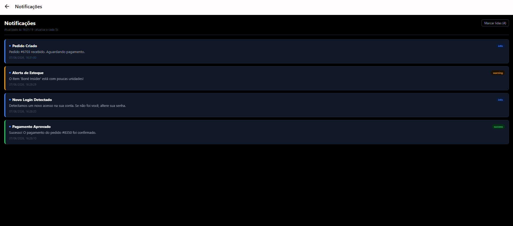
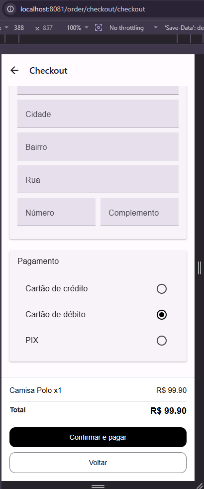
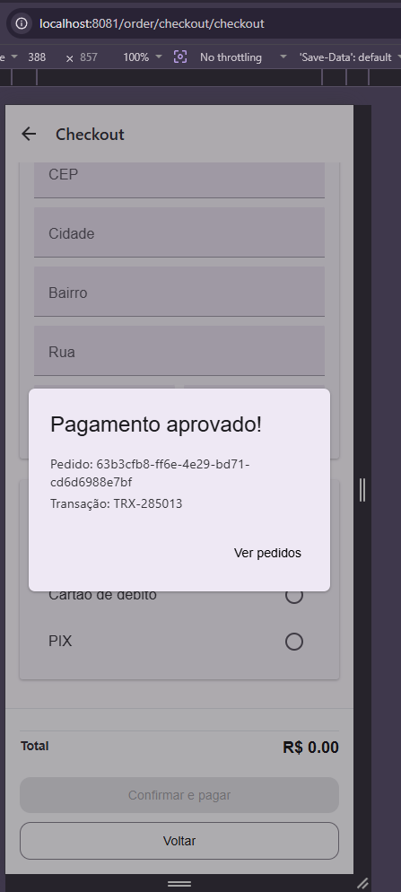
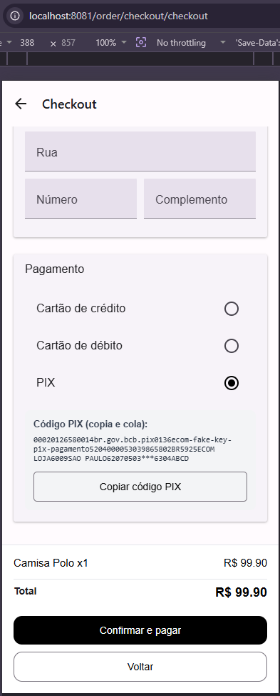
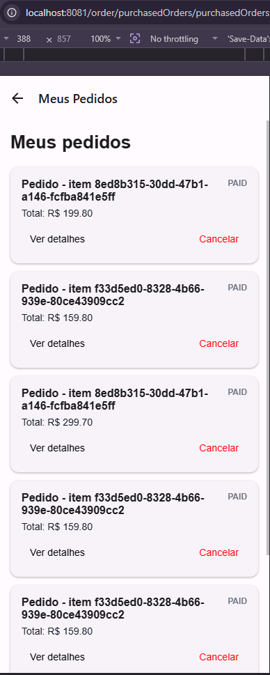

# Front-end Móvel

[Inclua uma breve descrição do projeto e seus objetivos.]

## Projeto da Interface
[Descreva o projeto da interface móvel da aplicação, incluindo o design visual, layout das páginas, interações do usuário e outros aspectos relevantes.]

### Wireframes

[Inclua os wireframes das páginas principais da interface, mostrando a disposição dos elementos na página.]

### Design Visual

[Descreva o estilo visual da interface, incluindo paleta de cores, tipografia, ícones e outros elementos gráficos.]

## Fluxo de Dados

[Diagrama ou descrição do fluxo de dados na aplicação.]

## Tecnologias Utilizadas

[Lista das tecnologias principais que serão utilizadas no projeto.]

## Considerações de Segurança

[Discuta as considerações de segurança relevantes para a aplicação distribuída, como autenticação, autorização, proteção contra ataques, etc.]

## Implantação

[Instruções para implantar a aplicação distribuída em um ambiente de produção.]

1. Defina os requisitos de hardware e software necessários para implantar a aplicação em um ambiente de produção.
2. Escolha uma plataforma de hospedagem adequada, como um provedor de nuvem ou um servidor dedicado.
3. Configure o ambiente de implantação, incluindo a instalação de dependências e configuração de variáveis de ambiente.
4. Faça o deploy da aplicação no ambiente escolhido, seguindo as instruções específicas da plataforma de hospedagem.
5. Realize testes para garantir que a aplicação esteja funcionando corretamente no ambiente de produção.

## Testes

[Descreva a estratégia de teste, incluindo os tipos de teste a serem realizados (unitários, integração, carga, etc.) e as ferramentas a serem utilizadas.]

1. Crie casos de teste para cobrir todos os requisitos funcionais e não funcionais da aplicação.
2. Implemente testes unitários para testar unidades individuais de código, como funções e classes.
3. Realize testes de integração para verificar a interação correta entre os componentes da aplicação.
4. Execute testes de carga para avaliar o desempenho da aplicação sob carga significativa.
5. Utilize ferramentas de teste adequadas, como frameworks de teste e ferramentas de automação de teste, para agilizar o processo de teste.

# Referências

Inclua todas as referências (livros, artigos, sites, etc) utilizados no desenvolvimento do trabalho.

--- 

# Front-end Móvel — Módulo de Notificações

O módulo de notificações do front-end móvel é responsável por exibir em tempo real as notificações geradas pelos demais serviços do e-commerce (pedidos, pagamentos e estoque) diretamente no aplicativo mobile. A interface consome a mesma API REST do `NotificationService` utilizada pelo front-end web, adaptada para o contexto mobile com React Native.

---

## Projeto da Interface

O módulo é composto por dois componentes principais:

- **`NotificationBell`** — sino exibido no header do app com badge vermelho indicando notificações não lidas. Atualiza automaticamente a cada 5 segundos via polling.
- **`NotificationPage` (`index.tsx`)** — tela completa acessível via `/notification`, listando todas as notificações com suporte a pull-to-refresh e marcação como lidas.

### Wireframes

#### Tela de Notificações — `/notification`

```
┌─────────────────────────────┐
│ ← Notificações   [Marcar (N)]│
│ Atualizado às HH:MM · 5s    │
├─────────────────────────────┤
│ ┃ • Pagamento Aprovado  [success]│
│   Pedido #1234 confirmado.  │
│   31/05/2026, 15:05         │
├─────────────────────────────┤
│ ┃ • Alerta de Estoque  [warning]│
│   Item X com poucas unidades│
│   31/05/2026, 14:50         │
├─────────────────────────────┤
│ ┃   Novo Login Detectado [info]│
│   Acesso detectado na conta.│
│   31/05/2026, 14:30         │
└─────────────────────────────┘
```

Elementos da tela:
- **Header:** título "Notificações", timestamp da última atualização e botão "Marcar lidas (N)" visível apenas quando há não lidas.
- **Cards:** borda colorida à esquerda por tipo, ponto azul para não lidas, badge de tipo, mensagem e data formatada em pt-BR.
- **Pull-to-refresh:** arrastar a lista para baixo força atualização imediata.
- **Estado vazio:** mensagem "Nenhuma notificação encontrada." centralizada.
- **Estado de erro:** banner vermelho quando o backend está inacessível.

#### Sino no Menu — `ServicesDrawer`

```
┌─────────────────┐
│ INSIDER      ✕  │
│ [Avatar] Nome   │
│         email   │
├─────────────────┤
│ Minha Conta     │
│ 👤 Meu Perfil  ›│
│ 🔔 Notificações›│  ← adicionado
│ 🛒 Carrinho    ›│
├─────────────────┤
│ Catálogo        │
│ 🏷️ Categorias  ›│
└─────────────────┘
```

---

### Design Visual

| Item | Definição |
|---|---|
| Fundo da tela | `#000000` (preto) |
| Cards | `#111827` com borda `#1f2937` |
| Borda esquerda success | `#22c55e` (verde) |
| Borda esquerda warning | `#f59e0b` (amarelo) |
| Borda esquerda error | `#ef4444` (vermelho) |
| Borda esquerda info | `#3b82f6` (azul) |
| Texto principal | `#ffffff` |
| Texto secundário | `#9ca3af` |
| Texto terciário | `#4b5563` |
| Badge não lida | ponto `#3b82f6` |
| Badge tipo | fundo escuro com texto colorido por tipo |
| Notificação lida | opacidade 60% |
| Badge sino | vermelho `red` com texto branco |

Estilos aplicados via StyleSheet inline do React Native, sem biblioteca de componentes de UI — padrão do projeto.

---

## Fluxo de Dados

```
Backend (NotificationService :5000)
        │
        │  GET /api/notifications        (polling 5s)
        │  GET /api/notifications/unread-count  (polling 5s)
        │  PUT /api/notifications/mark-all-read
        ▼
App Mobile (React Native / Expo)
        │
        ├─► NotificationBell   → badge no menu
        └─► NotificationPage   → lista completa em /notification
```

**Como funciona:**
1. O `NotificationBell` faz polling a cada 5s em `GET /unread-count` e atualiza o badge.
2. Ao entrar em `/notification`, o `NotificationPage` busca todas as notificações e inicia polling de 5s.
3. O botão "Marcar lidas" chama `PUT /mark-all-read` e atualiza o estado local sem refetch.
4. Pull-to-refresh força busca imediata.

---

## Tecnologias Utilizadas

| Tecnologia | Versão | Uso |
|---|---|---|
| React Native | 0.76+ | Framework mobile |
| Expo | ~54.0 | Toolchain e runtime |
| expo-router | ~6.0 | Roteamento por sistema de arquivos |
| TypeScript | 5+ | Tipagem estática |
| Fetch API nativa | — | Chamadas HTTP ao backend |

---

## Considerações de Segurança

| Tópico | Estado atual |
|---|---|
| Autenticação | Endpoints públicos — sem autenticação aplicada no módulo de notificações |
| Transporte | HTTP local em desenvolvimento; HTTPS obrigatório em produção |
| Dados sensíveis | Notificações não contêm dados financeiros ou senhas |
| Token | O `NotificationService` não exige JWT atualmente; recomendado para produção |

**Recomendação para produção:** filtrar notificações por usuário autenticado, exigindo JWT nos endpoints `/api/notifications`.

---

## Implantação

A aplicação mobile roda via Expo em ambiente local. Implantação em produção (APK/IPA) ainda não foi configurada e está fora do escopo desta etapa.

**Execução local:**

1. Pré-requisitos: Node.js 20+, Expo CLI e Docker Desktop instalados.
2. Subir o banco e o backend de notificações:
   ```powershell
   docker start postgres_notif
   cd src/services/notification
   dotnet run
   ```
3. Subir o app mobile:
   ```powershell
   cd src/mobile
   npx expo start
   ```
4. Pressionar **W** para abrir no navegador ou escanear o QR Code com o **Expo Go** no celular.
5. Navegar via **Menu → Notificações**.

---

## Testes

### Estratégia

Testes funcionais manuais executados em ambiente local, cobrindo as interações do **módulo de Notificações** no front-end móvel. Validações de entrada, autenticação, performance e automação estão fora do escopo desta etapa.

---

### Mapeamento de interações

| ID | Interação | Componente | API back-end |
|---|---|---|---|
| M-I1 | Listar notificações | `notification/index.tsx` | `GET /api/notifications` |
| M-I2 | Atualização automática (polling) | `notification/index.tsx` | `GET /api/notifications` |
| M-I3 | Pull-to-refresh | `notification/index.tsx` | `GET /api/notifications` |
| M-I4 | Marcar todas como lidas | `notification/index.tsx` | `PUT /api/notifications/mark-all-read` |
| M-I5 | Badge de não lidas | `NotificationBell.tsx` | `GET /api/notifications/unread-count` |
| M-I6 | Navegar para notificações | `ServicesDrawer.tsx` | — |

---

### Casos de teste

#### Notificações Mobile — M-I1: Listagem

##### TC-M-I1-01 · Carregar lista de notificações

- **Pré-condições:**
  - Backend ativo em `http://localhost:5000`.
  - Ao menos uma notificação registrada no banco.
- **Passos:**
  1. Abrir o app e navegar para **Menu → Notificações**.
- **Resultado esperado:**
  - Tela exibe cards com título, mensagem, tipo e data formatada em pt-BR.
  - Cards não lidos exibem ponto azul e opacidade plena.
  - Cards lidos exibem opacidade reduzida (60%).
  - Borda esquerda colorida por tipo (verde/amarelo/azul/vermelho).
  - **Evidência:**
  

---

##### TC-M-I1-02 · Estado vazio

- **Pré-condições:**
  - Banco sem notificações.
- **Passos:**
  1. Navegar para **Menu → Notificações**.
- **Resultado esperado:**
  - Mensagem "Nenhuma notificação encontrada." exibida centralizada.

---

##### TC-M-I1-03 · Estado com backend indisponível

- **Pré-condições:**
  - Backend parado.
- **Passos:**
  1. Navegar para **Menu → Notificações**.
- **Resultado esperado:**
  - Banner de erro exibido: `⚠ Sem conexão com o servidor. Tentando reconectar...`
  - Notificações anteriores permanecem visíveis se já estavam carregadas.

---

#### Notificações Mobile — M-I2: Polling automático

##### TC-M-I2-01 · Nova notificação aparece sem recarregar

- **Pré-condições:**
  - Tela `/notification` aberta.
  - Backend ativo.
- **Passos:**
  1. Sem fechar a tela, disparar evento via terminal:
     ```powershell
     Invoke-WebRequest -Uri http://localhost:5000/api/demo/payment -Method Post
     ```
  2. Aguardar até 5 segundos.
- **Resultado esperado:**
  - Novo card aparece automaticamente no topo da lista.
  - Timestamp "Atualizado às HH:MM:SS" é atualizado.

---

#### Notificações Mobile — M-I3: Pull-to-refresh

##### TC-M-I3-01 · Atualizar lista manualmente

- **Pré-condições:**
  - Tela de notificações aberta.
- **Passos:**
  1. Arrastar a lista para baixo (gesto de pull-to-refresh).
- **Resultado esperado:**
  - Indicador de carregamento exibido brevemente.
  - Lista atualizada com dados mais recentes do backend.

---

#### Notificações Mobile — M-I4: Marcar como lidas

##### TC-M-I4-01 · Marcar todas como lidas

- **Pré-condições:**
  - Ao menos uma notificação não lida na lista.
- **Passos:**
  1. Verificar que o botão `Marcar lidas (N)` está visível no topo.
  2. Tocar no botão.
- **Resultado esperado:**
  - Todos os cards perdem o ponto azul e ficam com opacidade reduzida.
  - Botão "Marcar lidas" desaparece.
  - Badge do sino é zerado.

---

#### Notificações Mobile — M-I5: Badge

##### TC-M-I5-01 · Badge exibido com notificações não lidas

- **Pré-condições:**
  - Ao menos uma notificação não lida no banco.
- **Passos:**
  1. Observar o ícone 🔔 no menu.
- **Resultado esperado:**
  - Badge vermelho exibe o número de não lidas.
  - Atualiza automaticamente a cada 5 segundos.

##### TC-M-I5-02 · Badge ausente sem não lidas

- **Pré-condições:**
  - Todas as notificações marcadas como lidas.
- **Passos:**
  1. Observar o ícone 🔔 no menu.
- **Resultado esperado:**
  - Badge vermelho não é exibido.

---

#### Notificações Mobile — M-I6: Navegação

##### TC-M-I6-01 · Acessar notificações pelo menu

- **Pré-condições:**
  - App aberto em qualquer tela.
- **Passos:**
  1. Tocar em **Menu** na barra inferior.
  2. Tocar em **🔔 Notificações**.
- **Resultado esperado:**
  - App navega para a tela `/notification`.
  - Header exibe título "Notificações".
  - Lista é carregada corretamente.

---

### Fluxo de validação funcional

```powershell
# 1. Subir banco e backend
docker start postgres_notif
cd src/services/notification && dotnet run

# 2. Disparar eventos de teste
Invoke-WebRequest -Uri http://localhost:5000/api/demo/login   -Method Post
Invoke-WebRequest -Uri http://localhost:5000/api/demo/order   -Method Post
Invoke-WebRequest -Uri http://localhost:5000/api/demo/payment -Method Post
Invoke-WebRequest -Uri http://localhost:5000/api/demo/stock   -Method Post

# 3. Abrir o app
cd src/mobile && npx expo start
# Pressionar W → Menu → Notificações
```

---

## Testes — Módulo de Pagamento (Checkout Mobile)

Testes funcionais manuais cobrindo o fluxo de pagamento no app mobile. Pré-condição global: usuário autenticado, ao menos 1 item no carrinho.

### Inventário de itens de interface

| ID | Componente / Tela | Arquivo |
|----|---|---|
| M-P1 | Seletor de método (RadioButton.Group) | `app/order/checkout/checkout.tsx` |
| M-P2 | Botão "Confirmar e pagar" | `app/order/checkout/checkout.tsx` |
| M-P3 | Dialog de sucesso | `app/order/checkout/checkout.tsx` |
| M-P4 | Dialog de recusa + retry | `app/order/checkout/checkout.tsx` |
| M-P5 | Código PIX copiável | `app/order/checkout/checkout.tsx` |
| M-P6 | `transactionId` no modal de detalhes | `src/components/modals/OrderDetailsModal.tsx` |

---

### Casos de teste

#### Checkout Mobile — M-P1: Seletor de método visível

##### TC-M-P1-01 · Métodos de pagamento renderizados

- **Pré-condições:**
  - Tela de checkout aberta com itens no carrinho.
- **Passos:**
  1. Rolar até o card **Pagamento**.
- **Resultado esperado:**
  - Três opções visíveis: **Cartão de crédito**, **Cartão de débito**, **PIX**.
  - Opção selecionada exibe marcador preenchido.
- **Evidência:** 

---

#### Checkout Mobile — M-P2: Pagamento aprovado

##### TC-M-P2-01 · Fluxo feliz — aprovação

- **Pré-condições:**
  - Carrinho com total **não** terminando em `.99`.
- **Passos:**
  1. Selecionar método (ex: Cartão de crédito).
  2. Tocar em **Confirmar e pagar**.
- **Resultado esperado:**
  - Dialog de sucesso abre com status `PAID` e `transactionId`.
  - Tocar em **Ver pedidos** redireciona para lista de pedidos.
- **Evidência:** 

---

---

#### Checkout Mobile — M-P4: PIX copiável

##### TC-M-P4-01 · Código PIX exibido antes de confirmar

- **Pré-condições:**
  - Tela de checkout aberta.
- **Passos:**
  1. Selecionar **PIX** no RadioButton.
- **Resultado esperado:**
  - Card PIX expande com código longo visível e botão **Copiar código PIX**.
- **Evidência:** 

---

#### Pedidos Mobile — M-P5: transactionId visível

##### TC-M-P5-01 · transactionId no modal de detalhes

- **Pré-condições:**
  - Pedido `PAID` na lista de pedidos.
- **Passos:**
  1. Tocar em **Ver detalhes** no card do pedido.
- **Resultado esperado:**
  - Modal exibe linha `Transação: TRX-XXXXXX`.
- **Evidência:** 

---

## Referências

- [Expo Router — File-based routing](https://expo.github.io/router/docs)
- [React Native — Documentação oficial](https://reactnative.dev/docs/getting-started)
- `src/mobile/app/notification/index.tsx`
- `src/mobile/app/notification/NotificationBell.tsx`
- `src/mobile/src/components/ServicesDrawer.tsx`
- `src/mobile/app/_layout.tsx`
- `src/services/notification/Program.cs`
- `src/mobile/app/order/checkout/checkout.tsx`
- `src/mobile/src/services/orderService.ts`
- `src/mobile/src/components/modals/OrderDetailsModal.tsx`

---

# Front-end Móvel — Módulo de Usuário

O módulo de usuário é responsável por autenticação, cadastro e gerenciamento de perfil no aplicativo mobile. Consome a API REST do `UserService` (Node.js/Express) via `userService.ts`, com token JWT armazenado em memória via `tokenStore`.

---

## Projeto da Interface

O módulo é composto pelas seguintes telas:

- **`login.tsx`** — tela de autenticação com slideshow hero e formulário de e-mail/senha.
- **`register.tsx`** — cadastro em dois passos: dados de acesso (nome, e-mail, senha) e dados pessoais (CPF, telefone).
- **`profile.tsx`** — perfil completo do usuário com avatar, dados pessoais, endereço, segurança e zona de perigo.
- **`profile/edit.tsx`** — edição dos dados do perfil com máscaras de input (CPF, telefone, CEP).
- **`profile/password.tsx`** — alteração de senha com confirmação.
- **`admin/users.tsx`** — listagem e gerenciamento de usuários (apenas administradores).

### Wireframes

#### Tela de Login — `/login`

```
┌─────────────────────────────────────┐
│ ████████████  │  BEM-VINDO DE VOLTA │
│ INSIDER        │                     │
│ 01 / 03        │  Entrar             │
│                │  Acesse sua conta   │
│  Nova          │                     │
│  Coleção       │  E-mail             │
│ ──────         │  [ seu@email.com  ] │
│ Tendências...  │                     │
│ — SS 2026      │  Senha              │
│ ●  ○  ○        │  [ ••••••••  👁 ]  │
│                │                     │
│                │  [   Entrar   ]     │
│                │  ─────ou──────      │
│                │  [ Criar conta ]    │
└─────────────────────────────────────┘
```

Elementos da tela:
- **Hero (esquerda):** painel escuro com slideshow de 3 slides, número do slide, headline, linha dourada, subtítulo, tag e dots de navegação.
- **Formulário (direita):** eyebrow "Bem-vindo de volta", campos de e-mail e senha com validação inline, botão "Entrar" e botão "Criar conta".
- **Erro inline:** caixa vermelha exibida acima do botão quando credenciais inválidas.

#### Tela de Cadastro — `/register`

```
┌──────────────────────────────┐
│ INSIDER                       │
│ Crie sua                      │
│ conta.                        │
│ ──  [1]────[2]  Passo 1 de 2  │
├──────────────────────────────┤
│ PASSO 1 DE 2                  │
│ Dados de acesso               │
│                               │
│ Nome completo                 │
│ [ Seu nome completo        ]  │
│ E-mail                        │
│ [ seu@email.com            ]  │
│ Senha                         │
│ [ ••••••••            👁  ]  │
│ ███░░ Média                   │
│                               │
│ [      Continuar →        ]   │
│     Já tenho uma conta        │
└──────────────────────────────┘
```

- **Passo 1:** nome, e-mail, senha com indicador de força (fraca/média/forte).
- **Passo 2:** CPF e telefone (opcionais) + resumo da conta antes de confirmar.
- **Validação de e-mail duplicado:** ao clicar "Continuar", consulta `GET /auth/check-email` antes de avançar.

#### Tela de Perfil — `/profile`

```
┌──────────────────────────────┐
│ ████████████████████████████ │
│  [MV]  Marcos Vinicio        │
│  ⚑ Administrador             │
│  marcos@email.com            │
│  📅 Membro desde 01/06/2026  │
│ ─────────────────────────────│
│  Marcos │ 000.000│ (00)00000 │
│ ─────────────────────────────│
│ [✏ Editar perfil] [Alterar ] │
├──────────────────────────────┤
│ 👤 Dados pessoais      Editar│
│  NOME   Marcos Vinicio       │
│  E-MAIL marcos@email.com     │
│  CPF    Não informado        │
├──────────────────────────────┤
│ 📍 Endereço            Editar│
│  + Adicionar endereço        │
├──────────────────────────────┤
│ 🔒 Segurança          Alterar│
│  Senha de acesso             │
├──────────────────────────────┤
│ ⚠️ Zona de perigo             │
│  [ Desativar minha conta ]   │
└──────────────────────────────┘
```

#### Tela de Editar Perfil — `/profile/edit`

```
┌──────────────────────────────┐
│ 👤 Dados pessoais             │
│ [ Nome completo           ]  │
│ [ E-mail                  ]  │
│ [ CPF (opcional)          ]  │
│ [ Telefone (opcional)     ]  │
├──────────────────────────────┤
│ 📍 Endereço                  │
│ [ Rua / Logradouro        ]  │
│ [ CEP       ] [ Cidade    ]  │
│ [ UF ]                       │
├──────────────────────────────┤
│ [ Cancelar ] [   Salvar   ]  │
└──────────────────────────────┘
```

#### Tela de Alterar Senha — `/profile/password`

```
┌──────────────────────────────┐
│ 🔒 Alterar senha              │
│ [ Nova senha          👁  ]  │
│   Mínimo de 8 caracteres     │
│ [ Confirmar senha     👁  ]  │
│                               │
│ [ Cancelar ] [   Salvar   ]  │
└──────────────────────────────┘
```

#### Tela Admin — `/admin/users`

```
┌──────────────────────────────┐
│ Usuários                 🔄  │
│ [ 🔍 Buscar usuário...    ]  │
│ [ Todos ▾ ] [ Ativos ▾ ]    │
├──────────────────────────────┤
│ [MA] Marcos Admin    admin   │
│      marcos@email.com  ✓     │
│      [Desativar] [Excluir]   │
├──────────────────────────────┤
│ [JO] João Cliente  customer  │
│      joao@email.com    ✓     │
│      [Desativar] [Excluir]   │
└──────────────────────────────┘
```

---

### Design Visual

| Item | Definição |
|---|---|
| Fundo hero / header | `#0A0A0A` (preto) |
| Fundo formulário | `#F8F9FA` (cinza claro) |
| Cor de destaque (accent) | `#C9A96E` (dourado) |
| Cards | `#FFFFFF` com sombra leve |
| Botão primário | `#0A0A0A` com texto branco |
| Botão perigo | `#EF4444` (vermelho) |
| Texto principal | `#0A0A0A` |
| Texto secundário | `#9CA3AF` |
| Borda de input | `#E5E7EB` |
| Input com erro | borda `#EF4444`, fundo `#FFF5F5` |
| Status ativo | `#22C55E` (verde) |
| Badge admin | dourado `#C9A96E` |

Estilos aplicados via `StyleSheet` do React Native com componentes de `react-native-paper` (TextInput, Dialog, Snackbar).

---

## Fluxo de Dados

```
Backend (UserService :8080)
        │
        │  POST /auth/login
        │  POST /auth/register
        │  GET  /auth/check-email
        │  GET  /users/:id
        │  PUT  /users/:id
        │  PUT  /users/:id/password
        │  DELETE /users/:id
        │  GET  /users/all          (admin)
        │  PUT  /users/:id/reactivate (admin)
        │  DELETE /users/:id/permanent (admin)
        ▼
App Mobile (React Native / Expo)
        │
        ├─► AuthContext      → estado global de autenticação
        ├─► tokenStore       → token JWT em memória
        ├─► login.tsx        → autenticação
        ├─► register.tsx     → cadastro de novo usuário
        ├─► profile.tsx      → visualização do perfil
        ├─► profile/edit.tsx → edição de dados
        ├─► profile/password.tsx → alteração de senha
        └─► admin/users.tsx  → gestão de usuários (admin)
```

**Como funciona:**
1. O usuário faz login via `POST /auth/login` → token JWT e dados do usuário são armazenados no `AuthContext` e `tokenStore`.
2. Todas as requisições autenticadas enviam o token no header `Authorization: Bearer <token>`.
3. O `AuthContext` expõe `isAuthenticated` — telas protegidas redirecionam para `/login` se falso.
4. Ao desativar a conta, o usuário é deslogado imediatamente via `logout()`.

---

## Tecnologias Utilizadas

| Tecnologia | Versão | Uso |
|---|---|---|
| React Native | 0.81+ | Framework mobile |
| Expo | ~54.0 | Toolchain e runtime |
| expo-router | ~6.0 | Roteamento por sistema de arquivos |
| react-native-paper | ^5.15 | Componentes de UI (TextInput, Dialog, Snackbar) |
| TypeScript | ~5.9 | Tipagem estática |
| Fetch API nativa | — | Chamadas HTTP ao backend |
| JWT | — | Autenticação stateless |

---

## Considerações de Segurança

| Tópico | Estado atual |
|---|---|
| Autenticação | JWT gerado no backend, armazenado em memória (tokenStore) |
| Persistência de sessão | Não persistida — logout automático ao fechar o app |
| Senha | Hash bcrypt no backend; nunca trafega em texto plano após login |
| Validação de e-mail duplicado | Verificação via `GET /auth/check-email` antes do cadastro |
| Proteção de rotas | `isAuthenticated` no `AuthContext`; redirect para `/login` se não autenticado |
| Transporte | HTTP em desenvolvimento; HTTPS recomendado em produção |
| Desativação de conta | Soft delete — dados preservados, acesso bloqueado imediatamente |

**Recomendação para produção:** substituir `tokenStore` em memória por `expo-secure-store` para persistência segura do token entre sessões.

---

## Implantação

A aplicação mobile roda via Expo em ambiente local. Implantação em produção (APK/IPA) não foi configurada nesta etapa.

**Execução local:**

1. Pré-requisitos: Node.js 20+, Expo CLI instalado.
2. Subir o serviço de usuário:
   ```powershell
   cd src/services/user
   node src/server.js
   ```
3. Configurar a URL da API em `src/mobile/.env`:
   ```
   EXPO_PUBLIC_API_URL=http://localhost:8080
   ```
4. Subir o app mobile:
   ```powershell
   cd src/mobile
   npx expo start
   ```
5. Pressionar **W** para abrir no navegador ou escanear o QR Code com o **Expo Go** no celular.

---

## Testes

### Estratégia

Testes funcionais manuais cobrindo as interações do **módulo de Usuário** no front-end móvel. Pré-condição global: serviço `UserService` ativo em `http://localhost:8080` e banco PostgreSQL acessível.

---

### Mapeamento de interações

| ID | Interação | Componente | API back-end |
|---|---|---|---|
| M-U1 | Login com credenciais | `app/login.tsx` | `POST /auth/login` |
| M-U2 | Cadastro de novo usuário | `app/register.tsx` | `POST /auth/register` |
| M-U3 | Verificação de e-mail duplicado | `app/register.tsx` | `GET /auth/check-email` |
| M-U4 | Visualizar perfil | `app/profile.tsx` | — (dados do AuthContext) |
| M-U5 | Editar perfil | `app/profile/edit.tsx` | `PUT /users/:id` |
| M-U6 | Alterar senha | `app/profile/password.tsx` | `PUT /users/:id/password` |
| M-U7 | Desativar conta | `app/profile.tsx` | `DELETE /users/:id` |
| M-U8 | Listar usuários (admin) | `app/admin/users.tsx` | `GET /users/all` |
| M-U9 | Reativar usuário (admin) | `app/admin/users.tsx` | `PUT /users/:id/reactivate` |
| M-U10 | Excluir permanentemente (admin) | `app/admin/users.tsx` | `DELETE /users/:id/permanent` |

---

### Casos de teste

#### Usuário Mobile — M-U1: Login

##### TC-M-U1-01 · Login com credenciais válidas

- **Pré-condições:**
  - Usuário cadastrado no banco.
  - UserService ativo em `http://localhost:8080`.
- **Passos:**
  1. Abrir o app em `/login`.
  2. Preencher e-mail e senha válidos.
  3. Tocar em **Entrar**.
- **Resultado esperado:**
  - App redireciona para `/` (tela principal).
  - `AuthContext` contém dados do usuário autenticado.

---

##### TC-M-U1-02 · Login com credenciais inválidas

- **Pré-condições:**
  - UserService ativo.
- **Passos:**
  1. Preencher e-mail válido e senha errada.
  2. Tocar em **Entrar**.
- **Resultado esperado:**
  - Caixa de erro vermelha exibida: `"E-mail ou senha inválidos"`.
  - Usuário permanece na tela de login.

---

##### TC-M-U1-03 · Login com campos vazios

- **Passos:**
  1. Tocar em **Entrar** sem preencher os campos.
- **Resultado esperado:**
  - Mensagem de erro exibida nos campos: `"E-mail inválido"` e `"Informe a senha"`.
  - Nenhuma requisição ao backend.

---

#### Usuário Mobile — M-U2/U3: Cadastro

##### TC-M-U2-01 · Cadastro com e-mail novo — fluxo completo

- **Passos:**
  1. Navegar para `/register`.
  2. Preencher nome, e-mail novo, senha (≥8 caracteres).
  3. Tocar em **Continuar →**.
  4. Preencher CPF e telefone (opcionais).
  5. Tocar em **Criar conta**.
- **Resultado esperado:**
  - Usuário criado, token salvo, redirecionado para `/`.

---

##### TC-M-U3-01 · Cadastro com e-mail já cadastrado — bloqueio no passo 1

- **Pré-condições:**
  - E-mail já existe no banco.
- **Passos:**
  1. Preencher e-mail já cadastrado no passo 1.
  2. Tocar em **Continuar →**.
- **Resultado esperado:**
  - Chamada a `GET /auth/check-email` retorna `available: false`.
  - Erro inline exibido no campo e-mail: `"Este e-mail já está cadastrado"`.
  - Botão **Continuar** fica desabilitado.
  - Não avança para o passo 2.

---

#### Usuário Mobile — M-U5: Editar Perfil

##### TC-M-U5-01 · Salvar alterações de perfil

- **Pré-condições:**
  - Usuário autenticado.
- **Passos:**
  1. Navegar para `/profile/edit`.
  2. Alterar o campo nome.
  3. Tocar em **Salvar**.
- **Resultado esperado:**
  - Snackbar verde: `"Perfil atualizado com sucesso!"`.
  - Dados atualizados no `AuthContext` e na tela de perfil.

---

#### Usuário Mobile — M-U6: Alterar Senha

##### TC-M-U6-01 · Alterar senha com sucesso

- **Passos:**
  1. Navegar para `/profile/password`.
  2. Preencher nova senha (≥8 caracteres) e confirmar.
  3. Tocar em **Salvar**.
- **Resultado esperado:**
  - Snackbar verde: `"Senha alterada com sucesso!"`.
  - Campos limpos.

---

##### TC-M-U6-02 · Senhas não coincidem

- **Passos:**
  1. Preencher senhas diferentes nos campos "Nova senha" e "Confirmar".
  2. Tocar em **Salvar**.
- **Resultado esperado:**
  - Mensagem de erro: `"As senhas não coincidem"`.
  - Botão **Salvar** permanece desabilitado.

---

#### Usuário Mobile — M-U7: Desativar Conta

##### TC-M-U7-01 · Desativar conta com confirmação

- **Passos:**
  1. Na tela de perfil, tocar em **Desativar minha conta**.
  2. Confirmar no dialog.
- **Resultado esperado:**
  - Conta desativada via `DELETE /users/:id`.
  - Usuário deslogado e redirecionado para `/login`.

---

#### Usuário Mobile — M-U8/U9/U10: Admin

##### TC-M-U8-01 · Listar todos os usuários (admin)

- **Pré-condições:**
  - Usuário autenticado com role `admin`.
- **Passos:**
  1. Navegar para `/admin/users`.
- **Resultado esperado:**
  - Lista de todos os usuários (ativos e inativos) exibida.
  - Filtros de busca e status funcionando.

---

##### TC-M-U9-01 · Reativar usuário inativo

- **Passos:**
  1. Localizar usuário inativo na lista.
  2. Tocar em **Reativar**.
- **Resultado esperado:**
  - Usuário reativado, status atualizado na lista.

---

##### TC-M-U10-01 · Excluir usuário permanentemente

- **Passos:**
  1. Localizar usuário na lista.
  2. Tocar em **Excluir permanente** e confirmar.
- **Resultado esperado:**
  - Usuário removido do banco e da lista.

---

## Referências

- [Expo Router — File-based routing](https://expo.github.io/router/docs)
- [React Native — Documentação oficial](https://reactnative.dev/docs/getting-started)
- [react-native-paper — Documentação](https://callstack.github.io/react-native-paper/)
- `src/mobile/app/login.tsx`
- `src/mobile/app/register.tsx`
- `src/mobile/app/profile.tsx`
- `src/mobile/app/profile/edit.tsx`
- `src/mobile/app/profile/password.tsx`
- `src/mobile/app/admin/users.tsx`
- `src/mobile/src/contexts/AuthContext.tsx`
- `src/mobile/src/services/userService.ts`
- `src/services/user/src/controllers/authController.js`
- `src/services/user/src/routes/auth.routes.js`
