# Front-end Web

Interface web do e-commerce escalável. SPA React que consome microsserviços via gateway único. Cobre catálogo, carrinho/pedidos, estoque (admin), notificações e contas de usuário.

## Projeto da Interface Web

SPA renderizada no cliente. Roteamento por `react-router-dom`. Cada módulo de negócio (catalog, stock, order, user, notification) tem pasta própria em `src/frontend/<modulo>/` com `pages/`, `components/` e rotas locais (`*Routes.tsx`) montadas em `App.tsx`. Estilização via Tailwind CSS v4 (utility-first); sem biblioteca de componentes — componentes próprios em `src/frontend/components/` (Toast, Modal, Header, etc.).

### Wireframes

#### Estoque — `/stock` (admin)

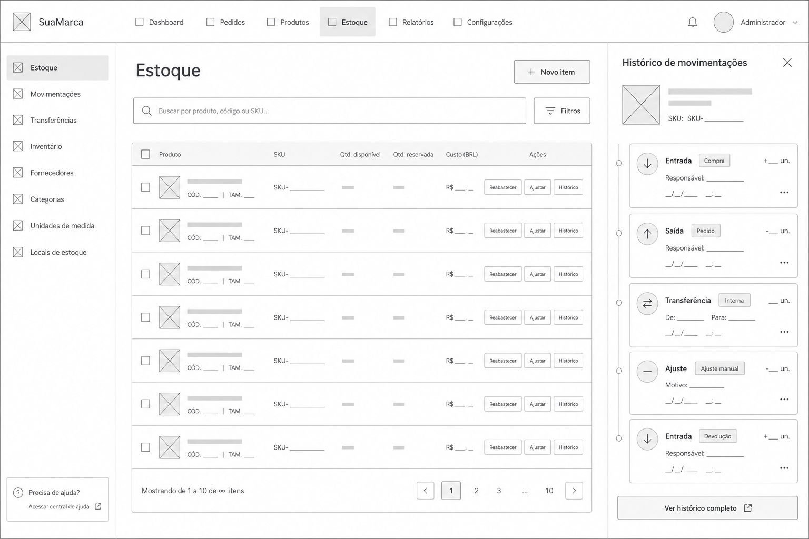

Elementos da tela:

- **Header (topo):** logo, navegação (Catálogo, Estoque, Pedidos), sino de notificações com badge, avatar do usuário.
- **Cabeçalho da página:** título "Estoque" e botão primário "+ Novo item".
- **Busca:** input full-width filtrando por SKU, nome ou código.
- **Tabela:** imagem | produto (nome + código + tamanho) | SKU (clicável para copiar) | Disponível | Reservado | Custo (BRL) | Ações (Reabastecer, Ajustar, Histórico).
- **Modais:** Novo item (SKU UUID, quantidade, custo), Reabastecer (quantidade), Ajustar (delta, motivo).
- **Drawer lateral (Histórico):** lista de movimentos com tipo, quantidade com sinal, data e — quando aplicável — pedido associado ou motivo.

**Como implementar:**
- Página em `src/frontend/stock/pages/stockListPage.tsx`.
- Tabela alimentada por `GET /stock/detailed-items` via `stockClientService.getAllStockItemsDetailed()`.
- Busca client-side com `useMemo` filtrando por `skuId`, `product.name`, `product.code`.
- Modais (`CreateStockModal`, `RestockModal`, `AdjustModal`) controlados por estado local; `onSuccess` recebe o `StockItem` atualizado e faz merge na lista sem refetch.
- Histórico como `HistoryDrawer` (overlay + painel à direita); carrega via `GET /stock/{skuId}/history` ao abrir.

### Design Visual

| Item        | Definição                                                         |
|-------------|-------------------------------------------------------------------|
| Cores       | Tailwind defaults: `slate-*` (texto/bg), `indigo-600` (primary), `emerald-500` (sucesso), `rose-500` (erro/perigo), `amber-500` (alerta). |
| Tipografia  | Stack `system-ui, sans-serif`. Pesos: 400 corpo, 600 títulos, 700 hero. Tamanhos via escala Tailwind (`text-sm` a `text-3xl`). |
| Ícones      | `react-icons` (Feather/Heroicons via `Fi*`).                      |
| Layout      | Container central `max-w-7xl mx-auto px-4`. Cards `rounded-2xl shadow-sm`. Modais via portal próprio, overlay `bg-black/40`. |
| Moeda/data  | `Intl.NumberFormat('pt-BR', {style:'currency',currency:'BRL'})`, `Intl.DateTimeFormat('pt-BR')`. |
| Feedback    | Toast (`components/Toast.tsx`) com tipos `success`/`error`/`info`, auto-dismiss. |

**Como implementar:** classes utilitárias Tailwind direto no JSX. Sem CSS custom além de `index.css` (reset + variáveis Tailwind v4). Tokens visuais consistentes via reuso de classes (`btn-primary`, etc.) — não há config de tema custom; valores literais.

## Fluxo de Dados

```
React (browser)
      │
      │  fetch  →  VITE_API_URL
      ▼
Gateway Nginx — roteia por prefixo de URL
      │
      ├─► /api/catalog/*       → catalogapi
      ├─► /api/stock/*         → stockapi
      ├─► /api/orders/*        → orderapi   ──► reserve/confirm/release em stockapi
      ├─► /api/users/*         → usersapi
      ├─► /api/auth/*          → usersapi
      └─► /api/notifications/* → notificationworker

Estado no cliente:
- useState/useEffect locais por página (sem Redux/Zustand).
- Sessão (token + perfil) em LocalStorage, lido por authHeader().
```

**Como implementar:**
- Camada de acesso em `src/frontend/services/*ClientService.ts` (um por domínio). Todas usam `HttpClient` (`services/httpClient.ts`) que injeta base URL, headers e faz parse de erro.
- `VITE_API_URL` definido em `.env` aponta para o gateway. Frontend não conhece serviços individuais — só fala com o gateway.
- Autenticação: `authHeader()` lê token do storage e devolve `{ Authorization: 'Bearer ...' }`.
- Erros do backend chegam como JSON `{error, message}` — `HttpClient` lança `Error` com a mensagem; páginas exibem via Toast.

## Tecnologias Utilizadas

| Camada          | Tecnologia                                  | Por quê                                       |
|-----------------|---------------------------------------------|-----------------------------------------------|
| UI framework    | React 19                                    | Equipe familiar; ecossistema maduro.          |
| Build/dev       | Vite 8                                      | HMR rápido, build leve, TS nativo.            |
| Linguagem       | TypeScript 5                                | Tipos compartilhados com DTOs do backend.     |
| Roteamento      | react-router-dom 7                          | Rotas aninhadas por módulo.                   |
| Estilo          | Tailwind CSS 4 (`@tailwindcss/vite`)        | Utility-first; zero CSS custom relevante.     |
| Ícones          | react-icons                                 | Cobertura ampla (Feather, Hero, etc.).        |
| HTTP            | `fetch` nativo + wrapper `HttpClient`       | Sem dependência extra (axios).                |
| Lint            | ESLint 10 + typescript-eslint               | Regras hooks/refresh.                         |
| Gateway         | Nginx (containerizado)                      | Único host:porta para a SPA; CORS evitado.    |

**Como implementar:** `cd src/frontend && npm install && npm run dev` (porta 3000 ou 3001). Build de produção: `npm run build` (gera `dist/`).

## Considerações de Segurança

| Tópico               | Estado atual / como implementar                                                         |
|----------------------|------------------------------------------------------------------------------------------|
| Autenticação         | `POST /auth/login` → token JWT salvo em LocalStorage. `authHeader()` injeta em chamadas autenticadas. |
| Autorização          | Rotas admin (`/stock`, `/admin/usuarios`) protegidas por `RequireAuth`/`RequireAdmin` (HOC em `user/`) que checam `role` do perfil decodificado. |
| Transporte           | HTTPS obrigatório em produção (terminação no gateway). Em dev usa HTTP local.            |
| CORS                 | Gateway expõe single-origin → sem CORS cross-domain no browser.                          |
| XSS                  | React faz escape automático em `{}`; evitar `dangerouslySetInnerHTML`. Nenhum uso atual. |
| Storage de token     | LocalStorage (aceitável para projeto acadêmico). Migrar para cookie httpOnly em produção. |
| Validação            | Client valida campos antes de submit (CPF, e-mail, senha ≥ 8); backend revalida.         |
| Erros sensíveis      | Mensagens do backend exibidas via Toast sem stack trace; logs detalhados ficam no servidor. |

## Implantação

Atualmente a aplicação roda apenas em ambiente local via Docker Compose. Implantação em produção (provedor de nuvem, domínio público, HTTPS) ainda não foi configurada e está fora do escopo desta etapa.

**Execução local:**

1. Pré-requisitos: Docker Desktop e Node.js 20+ instalados.
2. Na raiz do repositório, subir o stack completo:
   ```
   cd src
   docker compose up -d
   ```
   Isso sobe gateway, banco, serviços de backend e RabbitMQ.
3. Em outro terminal, rodar o frontend em modo dev (HMR):
   ```
   cd src/frontend
   npm install
   npm run dev
   ```
4. Acessar a aplicação no endereço informado pelo Vite (`http://localhost:3000` ou `:3001`).
5. Build de produção local (gera `dist/`):
   ```
   npm run build
   ```

**Verificação após subir:**
- Login com usuário cadastrado.
- Abrir `/products` e confirmar que a lista carrega.
- Abrir `/stock` como admin e confirmar que itens aparecem.
- Adicionar item ao carrinho e finalizar pedido.

## Testes

### Estratégia

Testes funcionais manuais executados em ambiente local, cobrindo as interações do **módulo de Estoque (Stock)** no frontend web. Cada caso descreve apenas o caminho feliz. Validações de entrada, mensagens de erro, estados vazios, autenticação, performance, segurança e automação ficam fora deste escopo.

---

## Testes — Módulo de Estoque (Stock)

### Mapeamento de interações

Origem: `src/frontend/stock/`, `src/frontend/services/stockClientService.ts`. Página única em `/stock`.

| ID  | Interação                            | Componente                               | API back-end                          |
|-----|--------------------------------------|------------------------------------------|---------------------------------------|
| I1  | Listar itens com dados de produto    | `stockListPage.tsx`                      | `GET /stock/detailed-items`           |
| I2  | Buscar item por SKU/nome/código      | `stockListPage.tsx` (filtro client-side) | —                                     |
| I3  | Copiar SKU para clipboard            | `stockListPage.tsx` (`handleCopy`)       | —                                     |
| I4  | Criar item de estoque                | `CreateStockModal.tsx`                   | `POST /stock`                         |
| I5  | Reabastecer item                     | `RestockModal.tsx`                       | `PUT /stock/{skuId}/restock`          |
| I6  | Ajustar item (delta + motivo)        | `AdjustModal.tsx`                        | `PUT /stock/{skuId}/adjust`           |
| I7  | Visualizar histórico de movimentos   | `HistoryDrawer.tsx`                      | `GET /stock/{skuId}/history`          |

### Casos de teste

#### Stock — I1: Listagem

##### TC-I1-01 · Carregar lista de itens

- **Pré-condições:**
  - Back-end ativo.
  - Há ≥ 1 item cadastrado.
- **Passos:**
  1. Abrir `/stock`.
- **Resultado esperado:**
  - Tabela exibe colunas: Produto, SKU, Disponível, Reservado, Custo, Ações.
  - Cada linha mostra imagem, nome, código/tamanho, quantidades e custo formatado em BRL.
- **Evidência:** 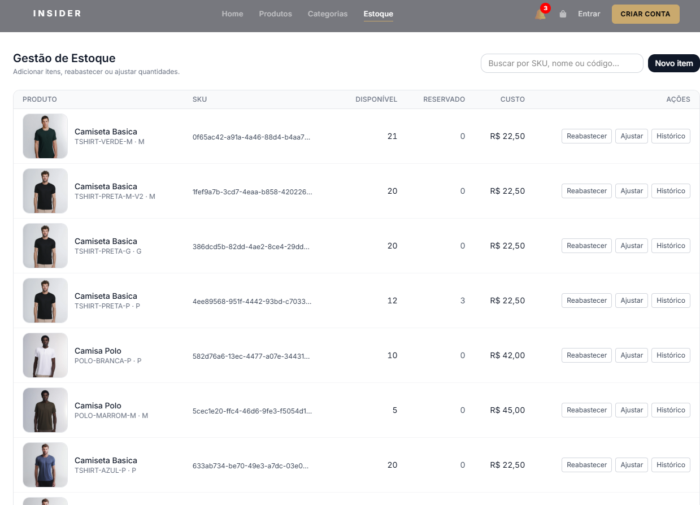

---

#### Stock — I2: Busca

##### TC-I2-01 · Filtrar por trecho do SKU

- **Pré-condições:**
  - Lista carregada com ≥ 2 itens de SKUs distintos.
- **Passos:**
  1. Digitar um trecho do SKU de um item no campo de busca.
- **Resultado esperado:**
  - Tabela mantém apenas linhas cujo SKU contém o trecho informado.
- **Evidência:** 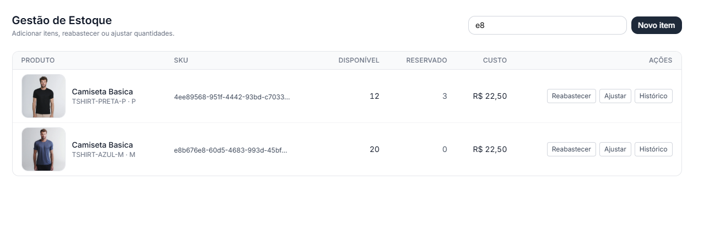

##### TC-I2-02 · Filtrar por nome do produto

- **Pré-condições:**
  - Lista carregada.
- **Passos:**
  1. Digitar parte do nome de um produto no campo de busca.
- **Resultado esperado:**
  - Tabela exibe apenas itens cujo nome contém o trecho.
- **Evidência:** 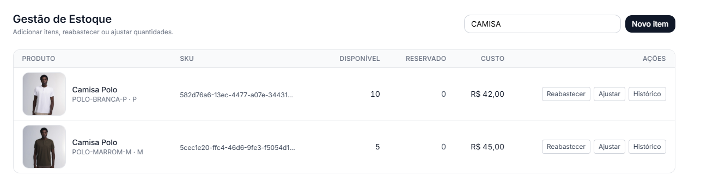

##### TC-I2-03 · Filtrar por SKU do produto

- **Pré-condições:**
  - Lista carregada com produtos que possuem `SKU` definido.
- **Passos:**
  1. Digitar parte de um código no campo de busca.
- **Resultado esperado:**
  - Tabela exibe apenas itens cujo código contém o trecho.
- **Evidência:** 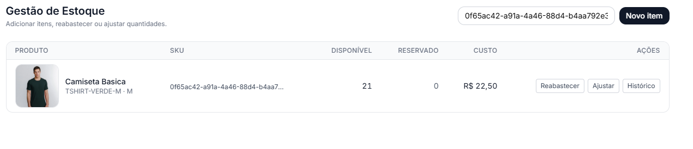

##### TC-I2-04 · Limpar busca

- **Pré-condições:**
  - Filtro ativo na busca.
- **Passos:**
  1. Apagar o conteúdo do campo de busca.
- **Resultado esperado:**
  - Tabela retorna ao conjunto completo de itens.
- **Evidência:** 

---

#### Stock — I3: Copiar SKU

##### TC-I3-01 · Copiar SKU da linha

- **Pré-condições:**
  - Lista carregada.
- **Passos:**
  1. Clicar sobre o SKU exibido em uma linha.
- **Resultado esperado:**
  - Conteúdo do SKU é gravado no clipboard do sistema.
- **Evidência:** 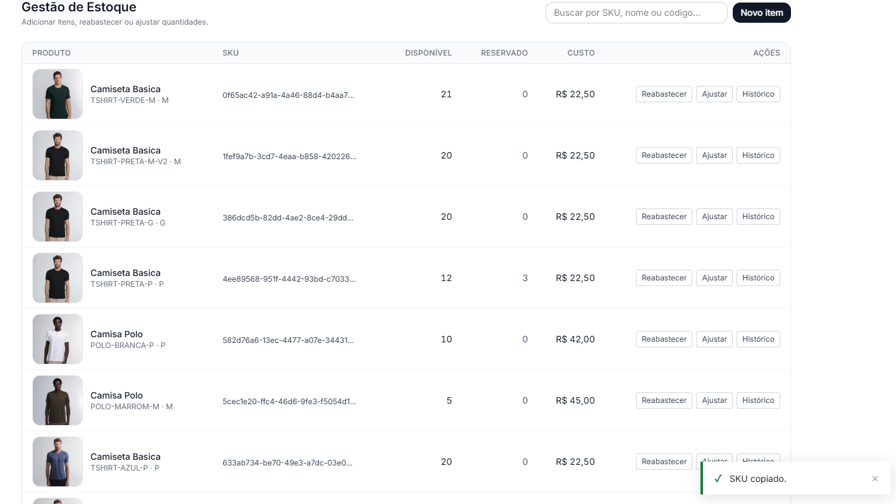

---

#### Stock — I4: Criar item

##### TC-I4-01 · Criar item com dados válidos

- **Pré-condições:**
  - Existe SKU UUID válido sem item de estoque associado.
- **Passos:**
  1. Clicar em **Novo item**.
  2. Informar o SKU UUID válido.
  3. Definir Quantidade inicial = `10`.
  4. Definir Custo = `40`.
  5. Clicar em **Criar**.
- **Resultado esperado:**
  - Modal fecha.
  - Lista é recarregada e exibe o novo item com `quantityAvailable = 10` e custo R$ 19,90.
- **Evidência:**
  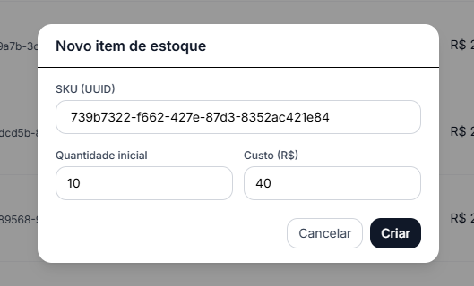
  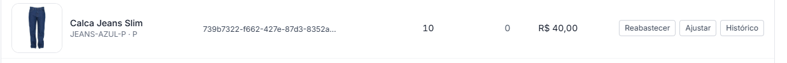


#### Stock — I5: Reabastecer

##### TC-I5-01 · Reabastecer com quantidade positiva

- **Pré-condições:**
  - Item de estoque existente com `quantityAvailable = N`.
- **Passos:**
  1. Na linha do item, clicar em **Reabastecer**.
  2. Definir Quantidade = `5`.
  3. Clicar em **Reabastecer**.
- **Resultado esperado:**
  - Modal fecha.
  - Linha do item passa a exibir `quantityAvailable = N + 5`.
- **Evidência:**
  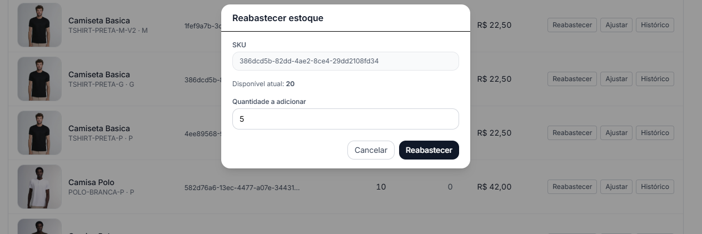
  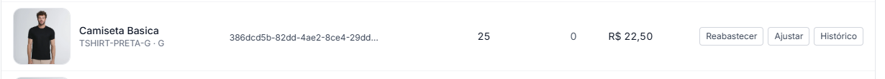


#### Stock — I6: Ajustar

##### TC-I6-01 · Ajuste positivo

- **Pré-condições:**
  - Item com `quantityAvailable = N`.
- **Passos:**
  1. Na linha do item, clicar em **Ajustar**.
  2. Definir Delta = `+3`.
  3. Informar Motivo = `entrada extra de fornecedor`.
  4. Clicar em **Ajustar**.
- **Resultado esperado:**
  - Modal fecha.
  - Linha do item passa a exibir `quantityAvailable = N + 3`.
- **Evidência:** 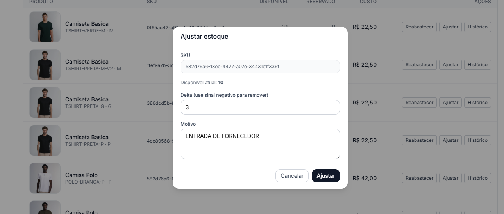

##### TC-I6-02 · Ajuste negativo dentro do disponível

- **Pré-condições:**
  - Item com `quantityAvailable ≥ 2`.
- **Passos:**
  1. Na linha do item, clicar em **Ajustar**.
  2. Definir Delta = `-2`.
  3. Informar Motivo = `contagem física`.
  4. Clicar em **Ajustar**.
- **Resultado esperado:**
  - Modal fecha.
  - Linha do item passa a exibir `quantityAvailable = N - 2`.
- **Evidência:** 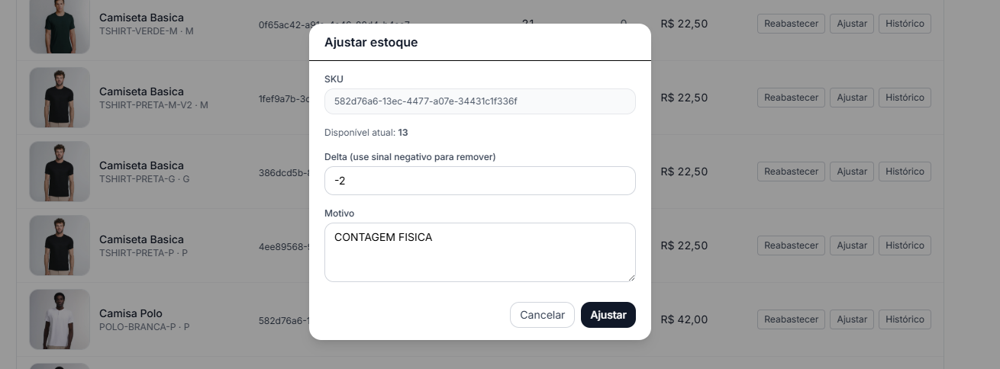

---

#### Stock — I7: Histórico

##### TC-I7-01 · Abrir histórico de um SKU

- **Pré-condições:**
  - Item com ≥ 1 movimento registrado.
- **Passos:**
  1. Na linha do item, clicar em **Histórico**.
- **Resultado esperado:**
  - Drawer lateral abre.
  - Lista exibe cada movimento com tipo, quantidade (com sinal) e data formatada em pt-BR.
- **Evidência:** 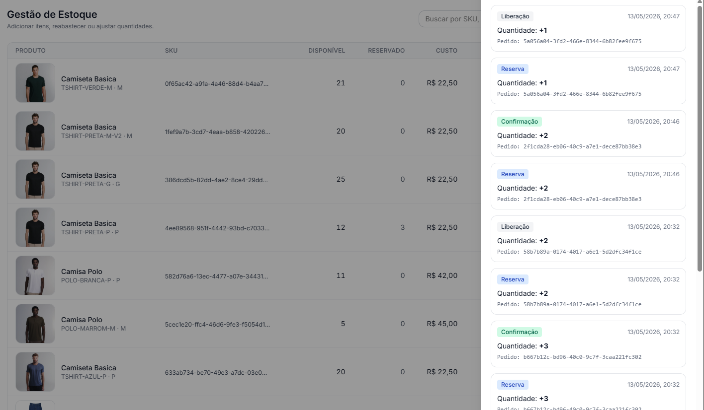

##### TC-I7-02 · Movimento com pedido associado

- **Pré-condições:**
  - Existe movimento `reserve`, `release` ou `confirm` com `orderId` preenchido.
- **Passos:**
  1. Abrir o histórico do SKU correspondente.
- **Resultado esperado:**
  - Item do histórico exibe a linha `Pedido: <uuid>`.
- **Evidência:** 

##### TC-I7-03 · Movimento com motivo

- **Pré-condições:**
  - Existe movimento de `adjustment` com `reason` preenchido.
- **Passos:**
  1. Abrir o histórico do SKU correspondente.
- **Resultado esperado:**
  - Item do histórico exibe a linha `Motivo: <texto>`.
- **Evidência:** 

##### TC-I7-04 · Rótulos por tipo de movimento

- **Pré-condições:**
  - Existem movimentos de tipos distintos no SKU.
- **Passos:**
  1. Abrir o histórico.
- **Resultado esperado:**
  - Cada movimento exibe o rótulo PT-BR correspondente: Reserva, Liberação, Confirmação, Reabastecimento, Ajuste.
- **Evidência:** 

---

## Testes — Módulo de Pedidos (Order)

### Mapeamento de interações

Origem: `src/frontend/order/`, `src/frontend/services/orderApi.js`  
Páginas: `/CartPage`, `/CheckoutPage`, `/OrdersPage`, `/orders/:id`

| ID  | Interação                          | Componente              | API back-end |
|-----|-----------------------------------|--------------------------|--------------|
| I12 | Visualizar itens do carrinho      | `CartPage.tsx`          | `GET /cart` |
| I13 | Adicionar item ao carrinho        | `ProductPage.tsx`       | `POST /cart/items` |
| I14 | Remover item do carrinho          | `CartPage.tsx`          | `DELETE /cart/items/{id}` |
| I15 | Alterar quantidade do item        | `CartPage.tsx`          | `PUT /cart/items/{id}` |
| I16 | Finalizar compra (checkout)       | `CheckoutPage.tsx`      | `POST /orders` |
| I17 | Listar pedidos do usuário         | `OrdersPage.tsx`        | `GET /orders/user/{userId}` |
| I18 | Visualizar detalhes do pedido     | `OrderDetailsPage.tsx`  | `GET /orders/{id}` |
| I19 | Cancelar pedido                   | `OrderDetailsPage.tsx`  | `POST /orders/{id}/cancel` |

---

### Casos de teste

### Pedido — I12: Carrinho

#### TC-I12-01 · Listar itens do carrinho (com itens)

- **Pré-condições:**
  - Carrinho possui ≥ 1 item.

- **Passos:**
  1. Acessar `/CartPage`.

- **Resultado esperado:**
  - Lista de itens exibida contendo:
    - Imagem do produto
    - Nome
    - Preço unitário
    - Quantidade
    - Subtotal por item
  - Total geral do carrinho calculado corretamente.

---

#### TC-I12-02 · Carrinho vazio (empty state)

- **Pré-condições:**
  - Carrinho sem itens.

- **Passos:**
  1. Acessar `/CartPage`.

- **Resultado esperado:**
  - Mensagem de carrinho vazio exibida.
  - Botão “Voltar as compras” visível.

---

### Pedido — I13: Adicionar ao carrinho

#### TC-I13-01 · Adicionar produto ao carrinho

- **Pré-condições:**
  - Produto disponível.

- **Passos:**
  1. Acessar `frontend/catalog/pages/ProductPage`.
  2. Selecionar a quantidade, cor e tamanho do produto. 
  3. Clicar em **Adicionar ao carrinho**.

- **Resultado esperado:**
  - Produto adicionado ao carrinho.
  - Carrinho atualizado em tempo real.
  - Modal informando que o produto foi adicionado ao carrinho
  - Modal exibe botões "Ver carrinho" e "Continuar comprando"

---

#### TC-I13-02 · Produto já existente no carrinho

- **Pré-condições:**
  - Produto já presente no carrinho.

- **Passos:**
  1. Clicar novamente em **Adicionar ao carrinho**.

- **Resultado esperado:**
  - Quantidade do item é incrementada.
  - Nenhum item duplicado é criado.

---

### Pedido — I14: Remover item

#### TC-I14-01 · Remover item com confirmação

- **Pré-condições:**
  - Carrinho possui ≥ 1 item.

- **Passos:**
  1. Acessar `/CartPage`.
  2. Clicar no ícone de lixeira.
  3. Confirmar remoção no modal.

- **Resultado esperado:**
  - Item removido da lista.
  - Total recalculado corretamente.
  - UI atualizada imediatamente.

---

#### TC-I14-02 · Cancelar remoção

- **Pré-condições:**
  - Modal de confirmação aberto.

- **Passos:**
  1. Clicar em **Cancelar** ou fora do modal.

- **Resultado esperado:**
  - Modal fechado.
  - Nenhuma alteração no carrinho.

---

### Pedido — I15: Alterar quantidade

#### TC-I15-01 · Incrementar quantidade

- **Pré-condições:**
  - Carrinho possui ≥ 1 item.

- **Passos:**
  1. Clicar em **+**.

- **Resultado esperado:**
  - Quantidade incrementada.
  - Subtotal atualizado.
  - Total recalculado.

---

#### TC-I15-02 · Decrementar quantidade

- **Pré-condições:**
  - Quantidade ≥ 2.

- **Passos:**
  1. Clicar em **-**.

- **Resultado esperado:**
  - Quantidade reduzida.
  - Não permite valor menor que 1.
  - Totais atualizados corretamente.

---

#### TC-I15-03 · Tentativa de reduzir abaixo de 1

- **Pré-condições:**
  - Quantidade = 1.

- **Passos:**
  1. Clicar em **-**.

- **Resultado esperado:**
  - Quantidade não é alterada.
  - Nenhum erro exibido.

---

#### TC-I15-04 · Quantidade decrementada antes do checkout quando há ≥ 2 itens

- **Pré-condições:**
  - Carrinho possui ≥ 2 itens.

- **Passos:**
  1. Clicar em botão "check".

- **Resultado esperado:**
  - Quantidade decrementada.
  - Subtotal atualizado.
  - Total recalculado.

#### TC-I15-05 · Remoção de item antes do checkout quando há 1 item

- **Pré-condições:**
  - Quantidade = 1.

- **Passos:**
  1. Clicar em botão "check".

- **Resultado esperado:**
  - Quantidade decrementada.
  - Subtotal atualizado.
  - Total recalculado.
  - Impossibilidade de proseguir para o checkout.

---

### Pedido — I16: Checkout

#### TC-I16-01 · Finalizar compra com sucesso

- **Pré-condições:**
  - Usuário autenticado.
  - Carrinho possui ≥ 1 item.
  - Botão "check" marcado em `/CartPage`

- **Passos:**
  1. Acessar `/CheckoutPage`.
  2. Preencher formulário de informações pessoais.
  3. Confirmar compra.

- **Resultado esperado:**
  - Pedido criado.
  - Modal exibe mensagem "Pedido realizado com sucesso!"
  - Item comprado é removido automaticamente de `CartPage` e enviado para `OrdersPage`.
  - Usuário redirecionado para `/OrdersPage`.

---

#### TC-I16-02 · Checkout com carrinho vazio

- **Pré-condições:**
  - Carrinho vazio.

- **Passos:**
  1. Tentar acessar `/checkout`.

- **Resultado esperado:**
  - Usuário impedido de continuar.
  - Redirecionamento ou mensagem de aviso.

---

### Pedido — I17: Listagem de pedidos

#### TC-I17-01 · Listar pedidos do usuário

- **Pré-condições:**
  - Usuário autenticado.
  - Usuário possui ≥ 1 pedidos.

- **Passos:**
  1. Acessar `/OrdersCard`.

- **Resultado esperado:**
  - Lista exibida contendo:
    - ID do pedido
    - Data
    - Status
    - Valor total

---

#### TC-I17-02 · Usuário sem pedidos (empty state)

- **Pré-condições:**
  - Usuário autenticado.
  - Usuário sem pedidos.

- **Passos:**
  1. Acessar `/OrdersCard`.

- **Resultado esperado:**
  - Mensagem “Você não tem pedidos.”.
  - Exibição de botão "voltar a pagina inicial".

#### TC-I17-03 · Excluir pedido

- **Pré-condições:**
  - Usuário autenticado.
  - Usuário sem pedidos.
  - Pedido com status diferente de "Entregue".

- **Passos:**
  1. Acessar `/OrdersCard`.
  2. Clicar em "cancelar pedido"
  3. Confirmar cancelamento de pedido

- **Resultado esperado:**
  - Pedido removido.
  - Pagina atualizada.
    
---

#### TC-I17-04 · Tentativa de cancelar pedido entregue

- **Pré-condições:**
  - Usuário autenticado.
  - Pedido com status "Entregue".

- **Passos:**
  1. Acessar `/OrdersCard`.
  2. Clicar em "cancelar pedido"

- **Resultado esperado:**
  - Exibição de mensagem "Pedidos já entregues não podem ser cancelados.".
    
---

#### TC-I17-05 · Remover pedido cancelado

- **Pré-condições:**
  - Usuário autenticado.
  - Pedido já cancelado.

- **Passos:**
  1. Acessar `/OrdersCard`.
  2. Clicar em "Excluir pedido"

- **Resultado esperado:**
  - Pedido é removida da lista de cancelados.
  - Pagina atualizada.

---

  ## Testes — Módulo de Catálogo: Produtos

  ### Mapeamento de interações

  Origem: `src/frontend/catalog/pages/ProductsPage.jsx`,
  `src/frontend/services/api.js`. Página em `/products`.

  | ID  | Interação | Componente | API back-end                                                                         |
  |-----|-----------|------------|------------                                                                          |
  | I19 | Listar e filtrar produtos | `ProductsPage.jsx` | `GET /catalog/products?name=&categoryId=&minPrice=&maxPrice=` |
  | I20 | Criar produto  | `ProductModal` (admin)| `POST /catalog/products`                                             |
  | I21 | Editar produto | `ProductModal` (admin) | `PUT /catalog/products/{id}`                                        |
  | I22 | Deletar produto | `ConfirmModal` (admin) | `DELETE /catalog/products/{id}`                                     |

  ### Casos de teste

  #### Produtos — I19: Listagem e filtros

  ##### TC-I19-01 · Carregar lista de produtos

  - **Pré-condições:**
    - Back-end ativo.
    - Há ≥ 1 produto cadastrado.
  - **Passos:**
    1. Abrir `/products`.
  - **Resultado esperado:**
    - Cards de produto são exibidos com: imagem, categoria, nome, descrição
  resumida e preço a partir de (formatado em BRL).
    - Contador de resultados é exibido acima da grade.

  ##### TC-I19-02 · Filtrar por nome

  - **Pré-condições:**
    - Lista carregada com ≥ 2 produtos de nomes distintos.
  - **Passos:**
    1. Digitar parte do nome de um produto no campo "Buscar por nome...".
    2. Clicar em **Filtrar**.
  - **Resultado esperado:**
    - A grade exibe apenas produtos cujo nome contém o trecho informado.

  ##### TC-I19-03 · Filtrar por categoria

  - **Pré-condições:**
    - Lista carregada com produtos de categorias distintas.
  - **Passos:**
    1. Selecionar uma categoria no campo de seleção.
    2. Clicar em **Filtrar**.
  - **Resultado esperado:**
    - A grade exibe apenas produtos pertencentes à categoria selecionada.

  ##### TC-I19-04 · Filtrar por faixa de preço

  - **Pré-condições:**
    - Existem produtos com preços variados.
  - **Passos:**
    1. Informar **Preço mínimo** e **Preço máximo**.
    2. Clicar em **Filtrar**.
  - **Resultado esperado:**
    - A grade exibe apenas produtos com ao menos um SKU cujo preço está dentro
   da faixa informada.

  ##### TC-I19-05 · Limpar filtros

  - **Pré-condições:**
    - Filtros ativos com resultados parciais.
  - **Passos:**
    1. Clicar em **Limpar**.
  - **Resultado esperado:**
    - Campos de filtro são resetados e a lista completa de produtos é
  recarregada.

  ---

  #### Produtos — I20: Criar produto

  ##### TC-I20-01 · Criar produto com dados válidos (admin)

  - **Pré-condições:**
    - Usuário autenticado com perfil `admin`.
  - **Passos:**
    1. Clicar em **+ Novo Produto**.
    2. Preencher **Nome**, **Descrição**, **URL da imagem** e selecionar uma
  **Categoria**.
    3. Clicar em **Criar produto**.
  - **Resultado esperado:**
    - Modal fecha.
    - Novo card do produto aparece no início da grade sem recarregar a página.

  ---

  #### Produtos — I21: Editar produto

  ##### TC-I21-01 · Editar produto existente (admin)

  - **Pré-condições:**
    - Usuário autenticado com perfil `admin`.
    - Há ≥ 1 produto cadastrado.
  - **Passos:**
    1. Passar o cursor sobre o card do produto — botões **Editar** e
  **Deletar** ficam visíveis.
    2. Clicar em **Editar**.
    3. Alterar ao menos um campo (ex.: nome).
    4. Clicar em **Salvar alterações**.
  - **Resultado esperado:**
    - Modal fecha.
    - Card do produto na grade reflete os novos dados sem recarregar a página.

  ---

  #### Produtos — I22: Deletar produto

  ##### TC-I22-01 · Deletar produto com confirmação (admin)

  - **Pré-condições:**
    - Usuário autenticado com perfil `admin`.
    - Há ≥ 1 produto cadastrado.
  - **Passos:**
    1. Passar o cursor sobre o card do produto.
    2. Clicar em **Deletar**.
    3. Clicar em **Deletar** no modal de confirmação.
  - **Resultado esperado:**
    - Modal de confirmação fecha.
    - Card do produto é removido da grade imediatamente.

  ##### TC-I22-02 · Cancelar exclusão

  - **Pré-condições:**
    - Modal de confirmação de exclusão aberto.
  - **Passos:**
    1. Clicar em **Cancelar** ou na área escurecida fora do modal.
  - **Resultado esperado:**
    - Modal fecha.
    - Produto permanece na grade.

  ---

  ## Testes — Módulo de Catálogo: Categorias

  ### Mapeamento de interações

  Origem: `src/frontend/catalog/pages/CategoriesPage.jsx`,
  `src/frontend/services/api.js`. Página em `/categories`.

 Testes — Módulo de Catálogo: Categorias
Mapeamento de interações
Origem: src/frontend/catalog/pages/CategoriesPage.jsx, src/frontend/services/api.js. Página em /categories.

 | ID  | Interação                      | Componente           | API back-end|
  |-----|--------------------------------|----------------------|---------------------------------------|
  | I23 | Listar categorias              | `CategoriesPage.jsx` | `GET /catalog/categories`             |
  | I24 | Listar produtos das categorias | `CategoriesPage.jsx` | `GET /products?categoryId={id}`       |
  | I25 | Criar categoria                | `CategoriesPage.jsx` | `POST /catalog/categories`            |
  | I26 | Editar categoria               | `CategoriesPage.jsx` | `PUT  /catalog/categories/{id}`        |
  | I27 | Deletar categoria              | `CategoriesPage.jsx` | `DELETE /catalog/categories/{id}`     |

  ### Casos de teste

  #### Categorias — I23: Listagem

  ##### TC-I23-01 · Carregar lista de categorias

  - **Pré-condições:**
    - Back-end ativo.
    - Há ≥ 1 categoria cadastrada.
  - **Passos:**
    1. Abrir `/categories`.
  - **Resultado esperado:**
    - Grade exibe cartões com nome e descrição (quando disponível) de cada categoria.
    - Cada cartão exibe o link **Ver produtos →**.

  ---

  #### Categorias — I24: Navegação

  ##### TC-I24-01 · Clicar em categoria redireciona para lista de produtos filtrada

  - **Pré-condições:**
    - Página `/categories` carregada com ≥ 1 categoria.
  - **Passos:**
    1. Clicar em qualquer cartão de categoria.
  - **Resultado esperado:**
    - Navegação para `/products?categoryId={id}` da categoria selecionada.
    - Página de produtos abre já filtrada pela categoria correspondente.

  ---

  #### Categorias — I25: Criar

  ##### TC-I25-01 · Criar categoria com dados válidos

  - **Pré-condições:**
    - Back-end ativo.
  - **Passos:**
    1. Clicar em **+ Nova Categoria**.
    2. Preencher Nome = `Calçados`.
    3. Preencher Descrição = `Tênis, sapatos e sandálias`.
    4. Clicar em **Criar categoria**.
  - **Resultado esperado:**
    - Modal fecha.
    - Grid é atualizado e exibe o novo card `Calçados` no topo.

  ##### TC-I25-02 · Tentar criar sem nome

  - **Pré-condições:**
    - Modal de criação aberto.
  - **Passos:**
    1. Deixar o campo Nome vazio.
    2. Clicar em **Criar categoria**.
  - **Resultado esperado:**
    - Mensagem de erro "Nome é obrigatório." exibida; modal permanece aberto.

  ---

  #### Categorias — I26: Editar

  ##### TC-I26-01 · Editar nome de uma categoria

  - **Pré-condições:**
    - Lista carregada com ≥ 1 categoria.
  - **Passos:**
    1. Passar o cursor sobre um card para revelar os botões de ação.
    2. Clicar em **Editar**.
    3. Alterar o nome para `Acessórios`.
    4. Clicar em **Salvar alterações**.
  - **Resultado esperado:**
    - Modal fecha.
    - Card exibe o nome atualizado `Acessórios`.

  ---

  #### Categorias — I27: Deletar

  ##### TC-I27-01 · Deletar categoria com confirmação

  - **Pré-condições:**
    - Lista carregada com ≥ 1 categoria.
  - **Passos:**
    1. Passar o cursor sobre um card para revelar os botões de ação.
    2. Clicar em **Deletar**.
    3. Confirmar no modal de confirmação.
  - **Resultado esperado:**
    - Modal fecha.
    - Card removido do grid.

  ##### TC-I27-02 · Cancelar exclusão

  - **Pré-condições:**
    - Modal de confirmação de exclusão aberto.
  - **Passos:**
    1. Clicar em **Cancelar**.
  - **Resultado esperado:**
    - Modal fecha sem alterações no grid.


---

## Testes — Módulo de Usuários (User)

### Mapeamento de interações

Origem: `src/frontend/user/pages/`, `src/frontend/services/userApi.ts`.

| ID  | Interação                              | Componente                | API back-end                              |
|-----|----------------------------------------|---------------------------|-------------------------------------------|
| I25 | Login com e-mail e senha               | `LoginPage.tsx`           | `POST /auth/login`                        |
| I26 | Cadastro de novo usuário               | `RegisterPage.tsx`        | `POST /auth/register`                     |
| I27 | Visualizar perfil                      | `ProfilePage.tsx`         | `GET /users/{id}`                         |
| I28 | Editar dados pessoais e endereço       | `EditProfilePage.tsx`     | `PUT /users/{id}`                         |
| I29 | Alterar senha                          | `ChangePasswordPage.tsx`  | `PUT /users/{id}/password`                |
| I30 | Desativar conta                        | `ProfilePage.tsx`         | `DELETE /users/{id}`                      |
| I31 | Listar todos os usuários (admin)       | `AdminUsersPage.tsx`      | `GET /admin/users`                        |
| I32 | Desativar / reativar usuário (admin)   | `AdminUsersPage.tsx`      | `DELETE /users/{id}` / `PUT /users/{id}/reactivate` |
| I33 | Excluir usuário permanentemente (admin)| `AdminUsersPage.tsx`      | `DELETE /admin/users/{id}/hard`           |

---

### Casos de teste

#### User — I25: Login

##### TC-I25-01 · Login com credenciais válidas

- **Pré-condições:**
  - Usuário cadastrado e ativo no sistema.
- **Passos:**
  1. Acessar `/login`.
  2. Preencher e-mail e senha corretos.
  3. Clicar em **Entrar**.
- **Resultado esperado:**
  - Usuário é autenticado e redirecionado para `/products`.
  - Header exibe avatar e nome do usuário.

##### TC-I25-02 · Login com credenciais inválidas

- **Pré-condições:**
  - Página de login aberta.
- **Passos:**
  1. Preencher e-mail correto e senha errada.
  2. Clicar em **Entrar**.
- **Resultado esperado:**
  - Mensagem de erro exibida abaixo do formulário.
  - Usuário permanece na página de login.

##### TC-I25-03 · Validação de campo e-mail

- **Pré-condições:**
  - Página de login aberta.
- **Passos:**
  1. Digitar um e-mail com formato inválido (ex.: `usuario@`).
  2. Sair do campo (blur).
- **Resultado esperado:**
  - Ícone de erro exibido no campo e-mail.
  - Mensagem de validação visível antes de submeter o formulário.

##### TC-I25-04 · Redirecionar usuário já autenticado

- **Pré-condições:**
  - Usuário já autenticado.
- **Passos:**
  1. Tentar acessar `/login` diretamente pela URL.
- **Resultado esperado:**
  - Sistema redireciona automaticamente para `/products`.

---

#### User — I26: Cadastro

##### TC-I26-01 · Cadastro em dois passos com dados válidos

- **Pré-condições:**
  - Nenhuma conta com o e-mail informado existe.
- **Passos:**
  1. Acessar `/cadastro`.
  2. Passo 1: preencher nome (≥ 3 chars), e-mail válido, senha (≥ 8 chars).
  3. Clicar em **Continuar**.
  4. Passo 2: preencher CPF e telefone (opcionais) ou prosseguir em branco.
  5. Clicar em **Criar conta**.
- **Resultado esperado:**
  - Conta criada com sucesso.
  - Usuário é autenticado e redirecionado para `/products`.

##### TC-I26-02 · Máscara automática de CPF

- **Pré-condições:**
  - Passo 2 do cadastro visível.
- **Passos:**
  1. Digitar 11 dígitos no campo CPF.
- **Resultado esperado:**
  - Campo exibe automaticamente o formato `000.000.000-00`.

##### TC-I26-03 · Máscara automática de telefone

- **Pré-condições:**
  - Passo 2 do cadastro visível.
- **Passos:**
  1. Digitar 11 dígitos no campo Telefone.
- **Resultado esperado:**
  - Campo exibe automaticamente o formato `(00) 00000-0000`.

##### TC-I26-04 · Barra de força de senha

- **Pré-condições:**
  - Campo Senha no passo 1 visível.
- **Passos:**
  1. Digitar senhas de diferentes complexidades (só letras, com número, com símbolo).
- **Resultado esperado:**
  - Barra de força muda de cor e nível (fraca → média → forte) conforme a complexidade.

---

#### User — I27: Visualizar Perfil

##### TC-I27-01 · Carregar dados do perfil

- **Pré-condições:**
  - Usuário autenticado.
- **Passos:**
  1. Acessar `/perfil`.
- **Resultado esperado:**
  - Hero exibe nome, e-mail, data de membro e iniciais do avatar.
  - Strip de estatísticas exibe CPF, telefone e cidade (ou `—` se não informado).
  - Cards exibem dados pessoais, endereço, segurança e zona de perigo.

##### TC-I27-02 · Acesso negado sem autenticação

- **Pré-condições:**
  - Usuário não autenticado.
- **Passos:**
  1. Tentar acessar `/perfil` diretamente pela URL.
- **Resultado esperado:**
  - Sistema redireciona para `/login`.

---

#### User — I28: Editar Perfil

##### TC-I28-01 · Atualizar nome e e-mail

- **Pré-condições:**
  - Usuário autenticado em `/perfil/editar`.
- **Passos:**
  1. Alterar o campo **Nome completo**.
  2. Alterar o campo **E-mail**.
  3. Clicar em **Salvar alterações**.
- **Resultado esperado:**
  - Toast de sucesso exibido.
  - Botão **Salvar** muda para **Salvo!** com ícone de check.
  - Usuário é redirecionado para `/perfil` após 1,6 s.
  - Header reflete o novo nome imediatamente.

##### TC-I28-02 · Máscara de CEP

- **Pré-condições:**
  - Formulário de edição aberto.
- **Passos:**
  1. Digitar 8 dígitos no campo CEP.
- **Resultado esperado:**
  - Campo exibe automaticamente o formato `00000-000`.

---

#### User — I29: Alterar Senha

##### TC-I29-01 · Alterar senha com dados válidos

- **Pré-condições:**
  - Usuário autenticado em `/perfil/senha`.
- **Passos:**
  1. Preencher **Senha atual** corretamente.
  2. Preencher **Nova senha** (≥ 8 chars).
  3. Repetir a nova senha em **Confirmar nova senha**.
  4. Clicar em **Salvar nova senha**.
- **Resultado esperado:**
  - Toast de sucesso exibido.
  - Formulário é resetado.

##### TC-I29-02 · Confirmação de senha divergente

- **Pré-condições:**
  - Formulário de alteração de senha aberto.
- **Passos:**
  1. Preencher **Nova senha** e **Confirmar nova senha** com valores diferentes.
  2. Clicar em **Salvar nova senha**.
- **Resultado esperado:**
  - Mensagem de erro indicando que as senhas não coincidem.
  - Requisição não é enviada ao back-end.

---

#### User — I30: Desativar Conta

##### TC-I30-01 · Desativar conta com confirmação

- **Pré-condições:**
  - Usuário autenticado na página `/perfil`.
- **Passos:**
  1. Clicar em **Desativar minha conta**.
  2. Confirmar no modal clicando em **Confirmar**.
- **Resultado esperado:**
  - Toast de sucesso exibido.
  - Usuário é deslogado e redirecionado para `/login` após 2 s.

##### TC-I30-02 · Cancelar desativação

- **Pré-condições:**
  - Modal de confirmação aberto.
- **Passos:**
  1. Clicar em **Cancelar**.
- **Resultado esperado:**
  - Modal fecha sem nenhuma ação.
  - Conta permanece ativa.

---

#### User — I31: Listagem de Usuários (Admin)

##### TC-I31-01 · Carregar lista de usuários

- **Pré-condições:**
  - Usuário autenticado com perfil `admin`.
- **Passos:**
  1. Acessar `/admin/usuarios`.
- **Resultado esperado:**
  - Hero exibe estatísticas: total, ativos, inativos e admins.
  - Tabela lista todos os usuários com nome, e-mail, CPF, telefone, cargo e status.

##### TC-I31-02 · Filtrar por aba (Ativos / Inativos / Todos)

- **Pré-condições:**
  - Lista carregada com usuários ativos e inativos.
- **Passos:**
  1. Clicar na aba **Ativos**.
- **Resultado esperado:**
  - Tabela exibe apenas usuários com status ativo.
  - Toast exibe contagem: `Exibindo N usuários ativos.`

##### TC-I31-03 · Buscar usuário por nome ou e-mail

- **Pré-condições:**
  - Lista carregada.
- **Passos:**
  1. Digitar parte do nome ou e-mail no campo de busca.
- **Resultado esperado:**
  - Tabela filtra em tempo real exibindo apenas os registros correspondentes.

##### TC-I31-04 · Atualizar lista manualmente

- **Pré-condições:**
  - Página de admin carregada.
- **Passos:**
  1. Clicar no botão **Atualizar**.
- **Resultado esperado:**
  - Ícone do botão gira enquanto carrega.
  - Toast de sucesso exibe o total de usuários carregados.

---

#### User — I32: Desativar / Reativar Usuário (Admin)

##### TC-I32-01 · Desativar usuário ativo

- **Pré-condições:**
  - Admin autenticado. Há ao menos 1 usuário ativo na lista.
- **Passos:**
  1. Clicar em **Desativar** na linha do usuário.
  2. Confirmar no modal.
- **Resultado esperado:**
  - Status do usuário muda para **Inativo** na tabela sem recarregar a página.
  - Toast de sucesso exibido.

##### TC-I32-02 · Reativar usuário inativo

- **Pré-condições:**
  - Admin autenticado. Há ao menos 1 usuário inativo.
- **Passos:**
  1. Clicar na aba **Inativos**.
  2. Clicar em **Reativar** na linha do usuário.
  3. Confirmar no modal.
- **Resultado esperado:**
  - Status muda para **Ativo** na tabela.
  - Toast de sucesso exibido.

---

#### User — I33: Excluir Usuário Permanentemente (Admin)

##### TC-I33-01 · Excluir usuário com confirmação

- **Pré-condições:**
  - Admin autenticado. Há ao menos 1 usuário na lista.
- **Passos:**
  1. Clicar no ícone de lixeira (excluir) na linha do usuário.
  2. Ler o aviso de ação irreversível no modal.
  3. Clicar em **Excluir permanentemente**.
- **Resultado esperado:**
  - Usuário é removido da tabela imediatamente.
  - Toast de sucesso exibido.
  - Estatísticas do hero são atualizadas.

##### TC-I33-02 · Acesso bloqueado para não-admin

- **Pré-condições:**
  - Usuário autenticado com perfil `customer`.
- **Passos:**
  1. Tentar acessar `/admin/usuarios` pela URL.
- **Resultado esperado:**
  - Sistema redireciona para `/`.

---

# Referências

Inclua todas as referências (livros, artigos, sites, etc) utilizados no desenvolvimento do trabalho.


---

# Testes — Módulo de Notificações (Notifications)

## Mapeamento de interações

**Origem:** `src/frontend/notification/`, `src/services/notification/Program.cs`  
**Página principal:** `/notifications`

| ID | Interação | Componente | API back-end |
|---|---|---|---|
| I8 | Listar notificações do usuário | `NotificationPage.tsx` | `GET /api/notifications` |
| I9 | Exibir contador de não lidas (Badge) | `NotificationBell.jsx` | `GET /api/notifications/unread-count` |
| I10 | Marcar todas as notificações como lidas | `NotificationPage.tsx` | `PUT /api/notifications/mark-all-read` |
| I11 | Redirecionamento para a central | `Header` (sino) | — |

> **Observação:** A implementação atual marca **todas** as notificações como lidas de uma vez (`mark-all-read`), não individualmente.

---

## Casos de teste

#### Notifications — I8: Listagem

##### TC-I8-01 · Carregar lista de notificações

- **Pré-condições:**
  - Back-end (`NotificationService`) ativo em `http://localhost:5000`.
  - Ao menos uma notificação registrada no banco.
- **Passos:**
  1. Abrir a página `/notifications`.
- **Resultado esperado:**
  - A tela exibe cards com: Título, Mensagem, Data de recebimento e Tipo (`info`, `success`, `warning`).
  - Notificações não lidas possuem destaque visual com ponto azul e opacidade plena.
  - Notificações lidas aparecem com opacidade reduzida (60%).
  - O rodapé do card exibe a data/hora formatada em pt-BR.

---

##### TC-I8-02 · Atualização automática por polling

- **Pré-condições:**
  - Back-end ativo.
  - Página `/notifications` aberta no navegador.
- **Passos:**
  1. Sem recarregar a página, disparar uma nova notificação via `POST /api/demo/payment`.
  2. Aguardar até 5 segundos.
- **Resultado esperado:**
  - O novo card aparece automaticamente no topo da lista sem necessidade de recarregar a página.
  - O texto "Atualizado às HH:MM:SS · atualiza a cada 5s" é atualizado.

---

##### TC-I8-03 · Estado com backend indisponível

- **Pré-condições:**
  - Back-end inativo.
- **Passos:**
  1. Abrir a página `/notifications` com o serviço parado.
- **Resultado esperado:**
  - Exibe mensagem de erro: `⚠ Sem conexão com o servidor. Tentando reconectar...`
  - Notificações previamente carregadas permanecem visíveis (não são apagadas).

---

#### Notifications — I9: Contador

##### TC-I9-01 · Visualizar badge no Header

- **Pré-condições:**
  - Back-end ativo.
  - Usuário possui ≥ 1 notificação não lida.
- **Passos:**
  1. Observar o ícone de sino no cabeçalho em qualquer página.
- **Resultado esperado:**
  - Badge vermelho exibe o numeral correspondente ao total de notificações não lidas.
  - O badge atualiza automaticamente a cada 5 segundos sem recarregar a página.

---

##### TC-I9-02 · Badge ausente sem notificações não lidas

- **Pré-condições:**
  - Todas as notificações marcadas como lidas ou banco vazio.
- **Passos:**
  1. Observar o ícone de sino no cabeçalho.
- **Resultado esperado:**
  - O sino é exibido sem badge vermelho.

---

#### Notifications — I10: Ações

##### TC-I10-01 · Marcar todas como lidas

- **Pré-condições:**
  - Lista carregada com ao menos uma notificação não lida.
- **Passos:**
  1. Verificar que o botão `Marcar todas como lidas (N)` está visível no cabeçalho da página.
  2. Clicar no botão.
- **Resultado esperado:**
  - Todos os cards perdem o destaque visual de "não lida" (ponto azul some, opacidade reduz).
  - O botão "Marcar todas como lidas" desaparece da interface.
  - O badge do sino no Header é zerado.

---

#### Notifications — I11: Navegação

##### TC-I11-01 · Acesso via cabeçalho

- **Pré-condições:**
  - Usuário em qualquer rota do sistema.
- **Passos:**
  1. Clicar sobre o ícone do sino no Header.
- **Resultado esperado:**
  - O sistema redireciona o usuário para a página `/notifications`.
  - A lista de notificações é carregada corretamente.
- **Evidência:**
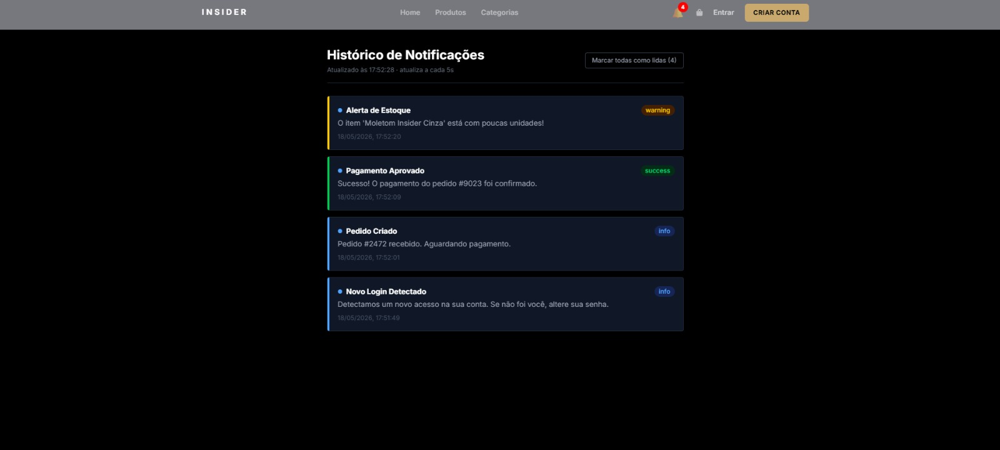

---

## Fluxo de validação funcional (demo)

Para validar o módulo completo sem depender dos demais serviços:

```powershell
# 1. Disparar eventos de demonstração
Invoke-WebRequest -Uri http://localhost:5000/api/demo/login   -Method POST
Invoke-WebRequest -Uri http://localhost:5000/api/demo/order   -Method POST
Invoke-WebRequest -Uri http://localhost:5000/api/demo/payment -Method POST
Invoke-WebRequest -Uri http://localhost:5000/api/demo/stock   -Method POST

# 2. Verificar resposta da API
# Acessar no navegador: http://localhost:5000/api/notifications
```

**Resultado esperado:** 4 notificações retornadas em JSON, visíveis em `http://localhost:3000/notifications`.

---

## Testes — Módulo de Pagamento (Checkout)

Testes funcionais manuais cobrindo o fluxo de pagamento integrado ao checkout web. Pré-condição global: usuário autenticado, ao menos 1 item no carrinho.

### Inventário de itens de interface

| ID | Componente / Tela | Arquivo |
|----|---|---|
| P1 | Seletor de método de pagamento | `CheckoutPage.jsx` |
| P2 | Botão "Confirmar e pagar" | `CheckoutPage.jsx` |
| P3 | Modal de sucesso (`OrderSuccessModal`) | `modals/OrderSuccessModal.jsx` |
| P4 | Modal de recusa (`PaymentDeclinedModal`) | `modals/PaymentDeclinedModal.jsx` |
| P5 | Código PIX copiável | `modals/OrderSuccessModal.jsx` |
| P6 | `transactionId` no card de pedido | `OrderCard.jsx` |
| P7 | `transactionId` no detalhe do pedido | `modals/OrderDetailsModal.jsx` |

---

### Casos de teste

#### Checkout — P1: Pagamento aprovado (valor redondo)

##### TC-P1-01 · Fluxo feliz — cartão de crédito aprovado

- **Pré-condições:**
  - Carrinho com produto cujo total **não** termina em `.99`.
- **Passos:**
  1. Acessar `/checkout`.
  2. Selecionar **Cartão de crédito**.
  3. Clicar em **Confirmar e pagar**.
- **Resultado esperado:**
  - `OrderSuccessModal` abre com status `PAID` e `transactionId` exibido.
  - Carrinho é esvaziado.
- **Evidência:** 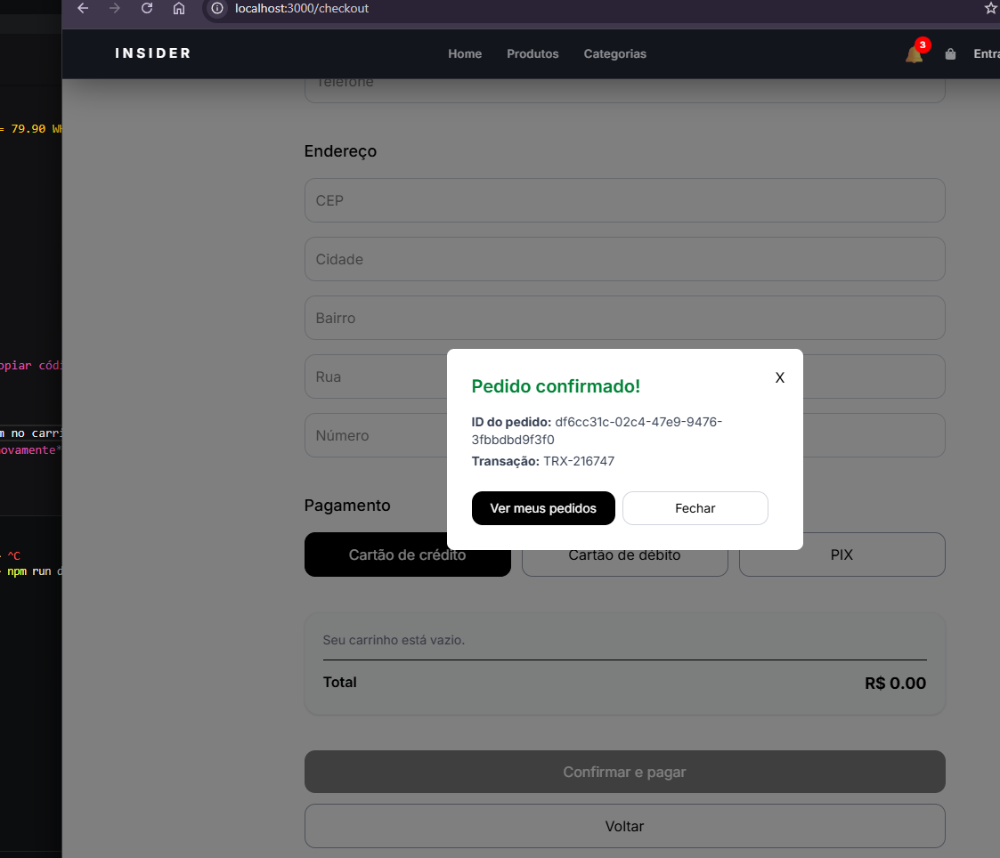

---

#### Checkout — P2: Pagamento recusado e retry

##### TC-P2-01 · Pagamento recusado — modal de recusa exibido

- **Pré-condições:**
  - Carrinho com produto cujo total termina exatamente em `.99` (ex: R$ 9,99).
- **Passos:**
  1. Acessar `/checkout`, selecionar método, clicar **Confirmar e pagar**.
- **Resultado esperado:**
  - `PaymentDeclinedModal` abre com mensagem de recusa.
  - Status do pedido = `PAYMENT_FAILED`.
  - Botão **Tentar novamente** visível.
- **Evidência:** 

---

#### Checkout — P3: PIX copiável

##### TC-P3-01 · Código PIX exibido e copiado

- **Pré-condições:**
  - Carrinho com valor redondo (aprovação simulada).
- **Passos:**
  1. Selecionar **PIX** no seletor de método.
  2. Confirmar pagamento.
  3. No `OrderSuccessModal`, clicar em **Copiar código PIX**.
- **Resultado esperado:**
  - Botão muda para **Copiado!** por ~2 s.
  - Código PIX na área de transferência.
- **Evidência:** 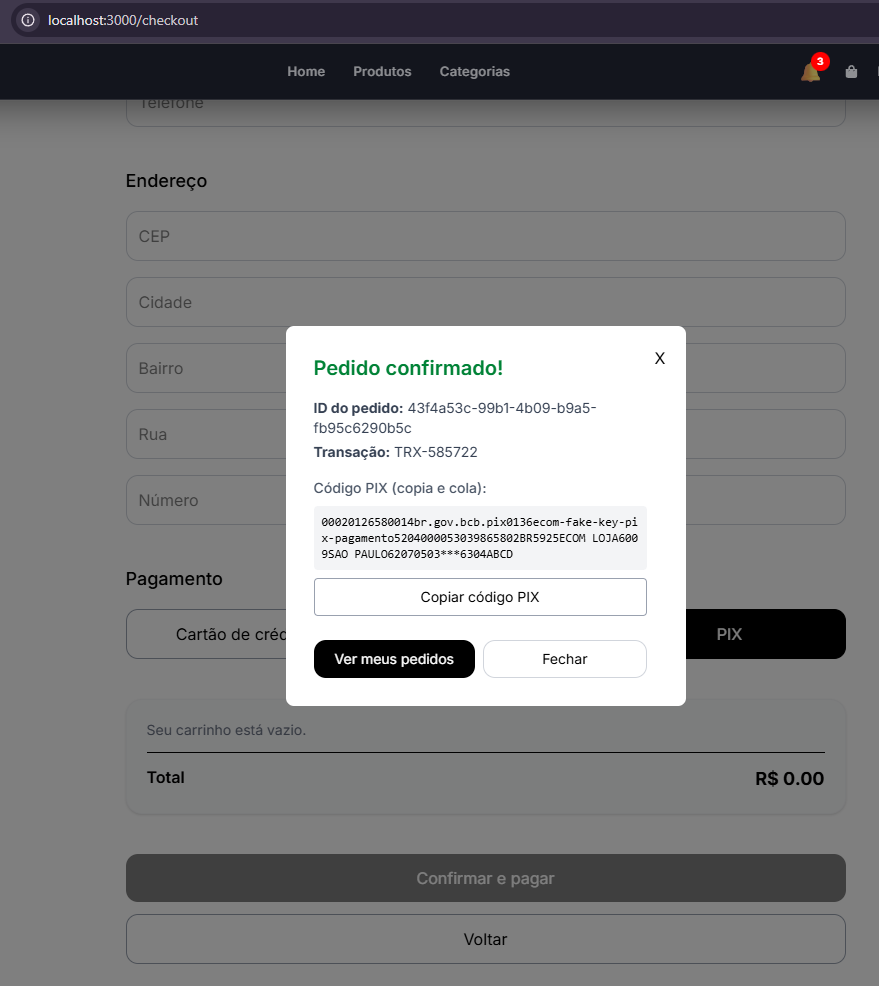

---

#### Pedidos — P4: transactionId visível

##### TC-P4-01 · transactionId no card de pedido

- **Pré-condições:**
  - Pedido `PAID` existente na listagem `/orders`.
- **Passos:**
  1. Acessar `/orders`.
- **Resultado esperado:**
  - Card exibe linha `Transação: TRX-XXXXXX`.
- **Evidência:** 

##### TC-P4-02 · transactionId no modal de detalhes

- **Pré-condições:**
  - Pedido `PAID` existente.
- **Passos:**
  1. Acessar `/orders`, clicar em **Página do produto** no card.
- **Resultado esperado:**
  - Modal exibe `Transação: TRX-XXXXXX`.
- **Evidência:** 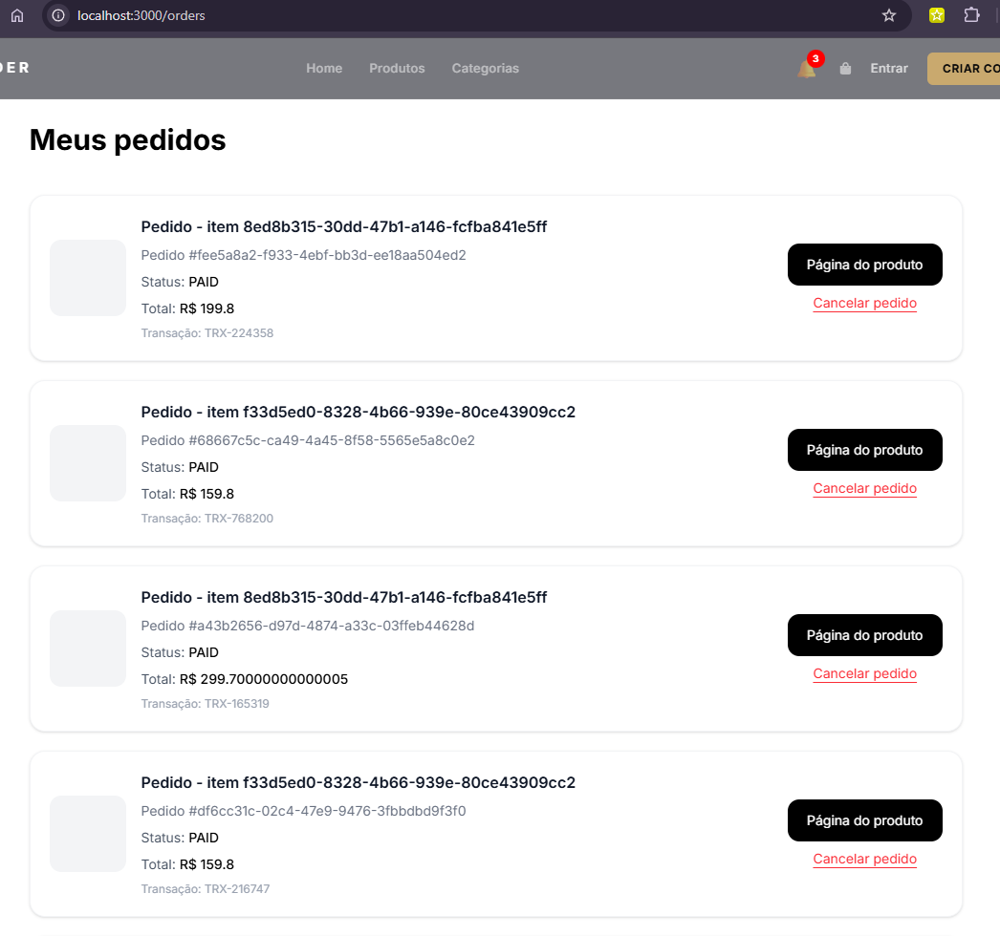

---

## Referências

- `src/services/notification/Program.cs`
- `src/frontend/notification/NotificationPage.tsx`
- `src/frontend/notification/NotificationBell.jsx`
- `src/frontend/notification/NotificationRoutes.jsx`
- `src/frontend/Order/pages/CheckoutPage.jsx`
- `src/frontend/Order/components/modals/OrderSuccessModal.jsx`
- `src/frontend/Order/components/modals/PaymentDeclinedModal.jsx`
- `src/frontend/Order/components/OrderCard.jsx`
- `src/frontend/Order/components/modals/OrderDetailsModal.jsx`
- `src/frontend/App.tsx`
